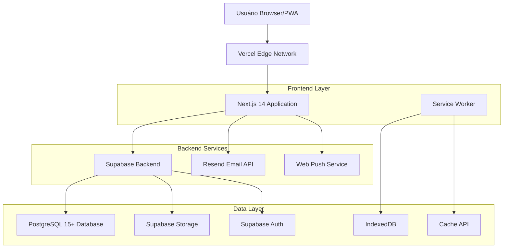
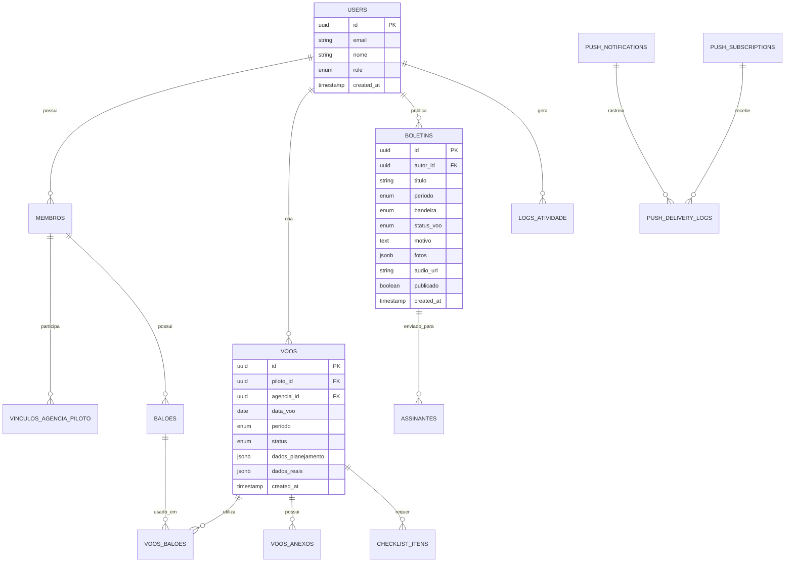
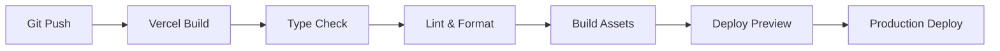

# Arquitetura Técnica - Sistema AVIBAQ

**Versão:** 1.0  
**Data:** Janeiro 2025  
**Status:** Produção Ativa  
**Projeto:** Sistema de Gestão para Associação de Pilotos e Empresas de Balonismo

---

## 1. Arquitetura Geral



## 2. Stack Tecnológico

### Frontend
- **Next.js 14**: Framework React com App Router e SSR/SSG
- **React 18**: Biblioteca principal com Concurrent Features
- **TypeScript 5.5**: Tipagem estática em modo strict
- **Tailwind CSS 3.4**: Framework CSS utilitário
- **shadcn/ui + Radix UI**: Componentes acessíveis
- **Magic UI**: Componentes animados customizados
- **Framer Motion**: Animações e transições
- **TanStack Query**: Gerenciamento de estado servidor

### Backend
- **Supabase**: Backend-as-a-Service completo
- **PostgreSQL 15+**: Banco de dados principal
- **Row Level Security**: Segurança granular
- **Edge Functions**: Lógica customizada
- **Resend**: API de e-mail transacional
- **Web Push API**: Notificações nativas

### Infraestrutura
- **Vercel**: Hospedagem com edge computing
- **CDN Global**: Cache distribuído
- **PWA**: Progressive Web App com offline
- **Service Worker**: Cache inteligente

## 3. Rotas da Aplicação

| Rota | Propósito | Acesso |
|------|-----------|--------|
| `/` | Homepage pública com boletins | Público |
| `/login` | Autenticação de usuários | Público |
| `/admin/dashboard` | Painel administrativo | Admin |
| `/admin/boletins` | Gestão de boletins meteorológicos | Admin/Meteo |
| `/admin/membros` | Gestão de membros | Admin/Tesouraria |
| `/piloto/dashboard` | Dashboard do piloto | Piloto |
| `/piloto/voos` | Gestão de voos | Piloto |
| `/piloto/planejamento` | Planejamento de voos | Piloto |
| `/agencia/dashboard` | Dashboard da agência | Agência |
| `/agencia/planejamento` | Planejamento comercial | Agência |
| `/api/send-boletim` | Envio automatizado de boletins | Sistema |
| `/api/join` | Cadastro de assinantes | Público |
| `/api/push/*` | Endpoints de notificações | Sistema |

## 4. APIs e Integrações

### 4.1 APIs Internas

**Autenticação e Usuários**
```
POST /api/auth/login
```
Request:
| Parâmetro | Tipo | Obrigatório | Descrição |
|-----------|------|-------------|----------|
| email | string | true | Email do usuário |
| password | string | true | Senha do usuário |

Response:
| Parâmetro | Tipo | Descrição |
|-----------|------|----------|
| user | object | Dados do usuário |
| session | object | Token de sessão |

**Gestão de Boletins**
```
POST /api/boletins
```
Request:
| Parâmetro | Tipo | Obrigatório | Descrição |
|-----------|------|-------------|----------|
| titulo | string | true | Título do boletim |
| periodo | enum | true | 'manha' ou 'tarde' |
| bandeira | enum | true | 'verde', 'amarela', 'vermelha' |
| status_voo | enum | true | Status das condições |
| motivo | text | true | Análise meteorológica |
| fotos | array | false | URLs das fotos |
| audio_url | string | false | URL do áudio |

**Sistema de Notificações**
```
POST /api/push/send
```
Request:
| Parâmetro | Tipo | Obrigatório | Descrição |
|-----------|------|-------------|----------|
| title | string | true | Título da notificação |
| body | string | true | Corpo da mensagem |
| target_roles | array | false | Roles específicos |
| scheduled_for | datetime | false | Agendamento |

### 4.2 Integrações Externas

- **Resend API**: Envio de e-mails transacionais
- **Web Push Services**: FCM, Mozilla Push, Apple Push
- **Supabase APIs**: Autenticação, Storage, Database

## 5. Modelo de Dados

### 5.1 Diagrama Entidade-Relacionamento



### 5.2 Tabelas Principais

**Tabelas Core (6)**
- `usuarios_admin`: Administradores com permissões especiais
- `users`: Usuários principais do sistema
- `membros`: Dados específicos de membros da associação
- `permissoes`: Sistema de permissões granulares
- `user_permissions`: Relacionamento usuário-permissões
- `permission_audit_log`: Auditoria de permissões

**Módulo Meteorológico (2)**
- `boletins`: Boletins com sistema de bandeiras
- `assinantes`: Lista de assinantes para e-mails

**Módulo de Voos (5)**
- `voos`: Registro completo de voos
- `voos_baloes`: Relacionamento voos-balões
- `voos_anexos`: Arquivos anexados
- `checklist_itens`: Sistema de checklist em 3 blocos
- `baloes`: Registro de equipamentos

**Módulo de Relacionamentos (1)**
- `vinculos_agencia_piloto`: Contratos entre agências e pilotos

**Sistema de Notificações (4)**
- `push_notifications`: Registro de notificações
- `push_subscriptions`: Dispositivos registrados
- `push_delivery_logs`: Log de entrega
- `push_scheduled_jobs`: Jobs agendados

**Sistema Auxiliar (1)**
- `dados_offline`: Fila de sincronização offline
- `paginas_cms`: Conteúdo gerenciável
- `logs_atividade`: Auditoria completa

## 6. Segurança e Permissões

### 6.1 Row Level Security (RLS)

Todas as tabelas implementam RLS com políticas específicas:

```sql
-- Exemplo: Política para tabela voos
CREATE POLICY "Pilotos podem ver seus próprios voos" ON voos
    FOR SELECT USING (piloto_id = auth.uid());

CREATE POLICY "Admins podem ver todos os voos" ON voos
    FOR ALL USING (auth.jwt() ->> 'role' = 'admin');
```

### 6.2 Sistema de Roles

| Role | Descrição | Permissões |
|------|-----------|------------|
| `admin` | Administrador geral | Acesso total ao sistema |
| `meteo` | Meteorologista | Criação e gestão de boletins |
| `tesouraria` | Tesouraria | Gestão financeira e membros |
| `piloto` | Piloto certificado | Gestão de voos e equipamentos |
| `agencia` | Agência de turismo | Operações comerciais |
| `leitura` | Acesso limitado | Somente leitura |

### 6.3 Auditoria

- **logs_atividade**: Registro de todas as ações sensíveis
- **permission_audit_log**: Histórico de mudanças de permissões
- **Triggers automáticos**: Captura automática de eventos

## 7. Performance e Otimização

### 7.1 Cache Strategy

```typescript
// Cache em múltiplas camadas
L1: Browser Cache (1min)
L2: Vercel Edge Cache (5min)
L3: Next.js ISR (1h)
L4: Supabase Query Cache (24h)
```

### 7.2 Índices do Banco

```sql
-- Índices críticos para performance
CREATE INDEX idx_voos_piloto_data ON voos(piloto_id, data_voo DESC);
CREATE INDEX idx_boletins_periodo_data ON boletins(periodo, created_at DESC);
CREATE INDEX idx_logs_usuario_data ON logs_atividade(user_id, created_at DESC);
CREATE INDEX idx_push_delivery_status ON push_delivery_logs(status, created_at);
```

### 7.3 Otimizações Frontend

- **Code Splitting**: Carregamento sob demanda
- **Image Optimization**: Next.js Image com lazy loading
- **Bundle Analysis**: Monitoramento de tamanho
- **Tree Shaking**: Eliminação de código não utilizado

## 8. Sistema Offline (PWA)

### 8.1 Service Worker Strategy

```javascript
// Estratégia de cache por tipo de recurso
const CACHE_STRATEGIES = {
  static: 'CacheFirst',      // CSS, JS, imagens
  api: 'NetworkFirst',       // APIs críticas
  boletins: 'StaleWhileRevalidate', // Boletins
  offline: 'CacheOnly'       // Dados offline
};
```

### 8.2 Sincronização

- **Queue Local**: IndexedDB para operações pendentes
- **Background Sync**: Sincronização automática
- **Conflict Resolution**: Estratégias de resolução
- **Retry Logic**: Tentativas automáticas

## 9. Monitoramento e Observabilidade

### 9.1 Métricas Principais

- **Performance**: Core Web Vitals, TTFB, FCP
- **Disponibilidade**: Uptime, error rate
- **Uso**: DAU, MAU, feature adoption
- **Negócio**: Boletins publicados, voos registrados

### 9.2 Logs Estruturados

```json
{
  "timestamp": "2025-01-15T10:30:00Z",
  "level": "info",
  "service": "avibaq-web",
  "traceId": "abc123",
  "userId": "user-456",
  "action": "voo_criado",
  "metadata": {
    "vooId": "voo-789",
    "pilotoId": "piloto-123"
  }
}
```

## 10. Deploy e CI/CD

### 10.1 Pipeline de Deploy



### 10.2 Ambientes

- **Development**: Local com Supabase local
- **Preview**: Deploy automático por PR
- **Production**: Deploy via merge na main

## 11. Conclusão

A arquitetura do Sistema AVIBAQ foi projetada para ser:

- **Escalável**: Suporta crescimento sem refatoração
- **Segura**: RLS e auditoria completa
- **Performante**: Cache multi-camadas e otimizações
- **Resiliente**: PWA com funcionalidades offline
- **Manutenível**: Código TypeScript bem estruturado

O sistema está em produção atendendo 100% dos requisitos funcionais com arquitetura moderna e robusta.