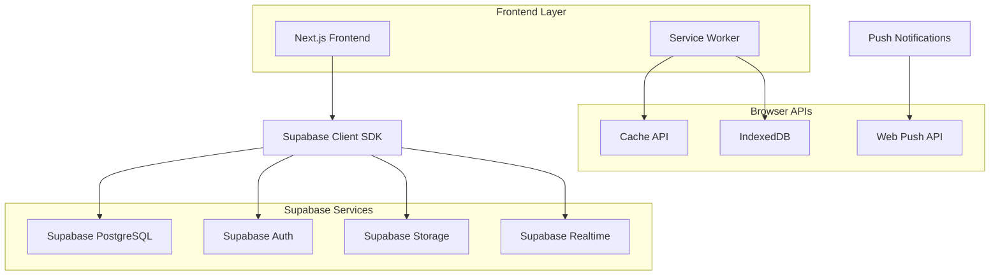

# 🏗️ Arquitetura Técnica de Integração Supabase - Sistema AVIBAQ

**Documento Técnico Complementar**  
**Foco:** Integração Frontend/Backend e Padrões de Desenvolvimento  
**Data:** Janeiro 2025

---

## 🎯 Visão Geral da Arquitetura

### Stack Tecnológico



### Princípios Arquiteturais

1. **Database-First**: Lógica de negócio no PostgreSQL via funções e triggers
2. **RLS-Driven Security**: Segurança implementada no nível do banco
3. **Offline-First PWA**: Funcionalidade completa offline com sincronização
4. **Real-time Updates**: Atualizações em tempo real via Supabase Realtime
5. **Type Safety**: TypeScript end-to-end com tipos gerados automaticamente

---

## 🔧 Configuração e Setup

### Variáveis de Ambiente

```env
# .env.local
NEXT_PUBLIC_SUPABASE_URL=https://elcbodhxzvoqpzamgown.supabase.co
NEXT_PUBLIC_SUPABASE_ANON_KEY=eyJhbGciOiJIUzI1NiIsInR5cCI6IkpXVCJ9...
SUPABASE_SERVICE_ROLE_KEY=eyJhbGciOiJIUzI1NiIsInR5cCI6IkpXVCJ9...
NEXT_PUBLIC_VAPID_PUBLIC_KEY=BK8...
VAPID_PRIVATE_KEY=...
```

### Cliente Supabase

```typescript
// src/integrations/supabase/client.ts
import { createClient } from '@supabase/supabase-js';
import type { Database } from './types';

const supabaseUrl = process.env.NEXT_PUBLIC_SUPABASE_URL!;
const supabaseAnonKey = process.env.NEXT_PUBLIC_SUPABASE_ANON_KEY!;

export const supabase = createClient<Database>(
  supabaseUrl,
  supabaseAnonKey,
  {
    auth: {
      persistSession: true,
      autoRefreshToken: true,
      detectSessionInUrl: true
    },
    realtime: {
      params: {
        eventsPerSecond: 10
      }
    }
  }
);

// Cliente para uploads com configurações específicas
export const supabaseUpload = createClient<Database>(
  supabaseUrl,
  supabaseAnonKey,
  {
    auth: { persistSession: false }
  }
);
```

### Tipos TypeScript Gerados

```typescript
// src/integrations/supabase/types.ts (gerado automaticamente)
export interface Database {
  public: {
    Tables: {
      users: {
        Row: {
          id: string;
          auth_id: string | null;
          email: string;
          username: string;
          role: string;
          nome: string;
          // ... outros campos
        };
        Insert: {
          id?: string;
          auth_id?: string | null;
          email: string;
          // ... campos obrigatórios
        };
        Update: {
          id?: string;
          email?: string;
          // ... campos opcionais
        };
      };
      // ... outras tabelas
    };
    Functions: {
      get_user_by_auth_id: {
        Args: { p_auth_id: string };
        Returns: Database['public']['Tables']['users']['Row'];
      };
      // ... outras funções
    };
  };
}
```

---

## 🔐 Sistema de Autenticação

### Fluxo de Autenticação

```typescript
// src/hooks/useAuth.ts
export function useAuth() {
  const [session, setSession] = useState<Session | null>(null);
  const [loading, setLoading] = useState(true);

  useEffect(() => {
    // Buscar sessão atual
    supabase.auth.getSession().then(({ data: { session } }) => {
      setSession(session);
      setLoading(false);
    });

    // Listener para mudanças de autenticação
    const {
      data: { subscription },
    } = supabase.auth.onAuthStateChange((_event, session) => {
      setSession(session);
      setLoading(false);
    });

    return () => subscription.unsubscribe();
  }, []);

  const signIn = async (email: string, password: string) => {
    const { data, error } = await supabase.auth.signInWithPassword({
      email,
      password,
    });
    
    if (error) throw error;
    return data;
  };

  const signOut = async () => {
    const { error } = await supabase.auth.signOut();
    if (error) throw error;
  };

  return {
    session,
    user: session?.user ?? null,
    loading,
    signIn,
    signOut,
  };
}
```

### Integração com Tabela Users

```typescript
// src/hooks/useUser.ts
export function useUser() {
  const { user: authUser } = useAuth();
  const [userData, setUserData] = useState(null);
  const [loading, setLoading] = useState(true);

  const fetchUserData = useCallback(async () => {
    if (!authUser) {
      setUserData(null);
      setLoading(false);
      return;
    }

    try {
      // Tentativa otimizada por auth_id
      let { data, error } = await supabase.rpc('get_user_by_auth_id', {
        p_auth_id: authUser.id
      });

      // Fallback para busca por email
      if (!data || error) {
        const result = await supabase
          .from('users')
          .select('*')
          .eq('email', authUser.email)
          .single();
        
        data = result.data;
        error = result.error;
      }

      if (error) throw error;
      
      setUserData({
        ...authUser,
        ...data,
        role: data?.role,
        whatsapp_group_joined: data?.whatsapp_group_joined,
        whatsapp_modal_shown: data?.whatsapp_modal_shown
      });
    } catch (error) {
      console.error('Erro ao buscar dados do usuário:', error);
      setUserData(null);
    } finally {
      setLoading(false);
    }
  }, [authUser]);

  useEffect(() => {
    fetchUserData();
  }, [fetchUserData]);

  return {
    user: userData,
    loading,
    refetch: fetchUserData
  };
}
```

---

## 🛡️ Sistema de Permissões

### Hook de Permissões

```typescript
// src/hooks/usePermissions.ts
interface Permission {
  recurso: string;
  acao: string;
  permitido: boolean;
}

export function usePermissions() {
  const { user } = useUser();
  const [permissions, setPermissions] = useState<Permission[]>([]);
  const [loading, setLoading] = useState(true);

  // Cache em memória para otimização
  const permissionsCache = useRef<Map<string, Permission[]>>(new Map());

  const fetchPermissions = useCallback(async (userId: string) => {
    // Verificar cache primeiro
    if (permissionsCache.current.has(userId)) {
      return permissionsCache.current.get(userId)!;
    }

    try {
      // Tentar função v2 primeiro
      let { data, error } = await supabase.rpc('get_combined_user_permissions_v2', {
        p_user_id: userId
      });

      // Fallback para função v1
      if (error) {
        const result = await supabase.rpc('get_user_combined_permissions', {
          p_user_id: userId
        });
        data = result.data;
        error = result.error;
      }

      if (error) throw error;

      const userPermissions = data || [];
      
      // Armazenar no cache
      permissionsCache.current.set(userId, userPermissions);
      
      return userPermissions;
    } catch (error) {
      console.error('Erro ao buscar permissões:', error);
      return [];
    }
  }, []);

  useEffect(() => {
    if (user?.id) {
      fetchPermissions(user.id).then(perms => {
        setPermissions(perms);
        setLoading(false);
      });
    } else {
      setPermissions([]);
      setLoading(false);
    }
  }, [user?.id, fetchPermissions]);

  const hasPermission = useCallback((recurso: string, acao: string) => {
    // Admins têm acesso total
    if (user?.role === 'admin') return true;
    
    return permissions.some(p => 
      p.recurso === recurso && 
      p.acao === acao && 
      p.permitido
    );
  }, [user?.role, permissions]);

  const hasAnyPermission = useCallback((checks: Array<{recurso: string, acao: string}>) => {
    return checks.some(({ recurso, acao }) => hasPermission(recurso, acao));
  }, [hasPermission]);

  const hasAllPermissions = useCallback((checks: Array<{recurso: string, acao: string}>) => {
    return checks.every(({ recurso, acao }) => hasPermission(recurso, acao));
  }, [hasPermission]);

  return {
    permissions,
    loading,
    hasPermission,
    hasAnyPermission,
    hasAllPermissions,
    refetch: () => {
      if (user?.id) {
        permissionsCache.current.delete(user.id);
        fetchPermissions(user.id).then(setPermissions);
      }
    }
  };
}
```

### Componente de Proteção

```typescript
// src/components/RequirePermission.tsx
interface RequirePermissionProps {
  recurso: string;
  acao: string;
  children: React.ReactNode;
  fallback?: React.ReactNode;
}

export function RequirePermission({ 
  recurso, 
  acao, 
  children, 
  fallback = null 
}: RequirePermissionProps) {
  const { hasPermission, loading } = usePermissions();

  if (loading) {
    return <div>Verificando permissões...</div>;
  }

  if (!hasPermission(recurso, acao)) {
    return <>{fallback}</>;
  }

  return <>{children}</>;
}

// Uso:
<RequirePermission 
  recurso="voos" 
  acao="criar"
  fallback={<div>Sem permissão para criar voos</div>}
>
  <CriarVooForm />
</RequirePermission>
```

---

## 📊 Padrões de Query e Mutation

### Queries com Relacionamentos

```typescript
// src/hooks/useVoos.ts
export function useVoos() {
  const [voos, setVoos] = useState([]);
  const [loading, setLoading] = useState(true);

  const fetchVoos = useCallback(async () => {
    try {
      const { data, error } = await supabase
        .from('voos')
        .select(`
          *,
          balao:baloes (
            id,
            prefixo,
            modelo,
            volume
          ),
          piloto:membros (
            id,
            nome_completo,
            email
          ),
          checklist_itens (
            id,
            marcado,
            bloco,
            item_numero
          ),
          voos_anexos (
            id,
            tipo,
            nome_arquivo
          )
        `)
        .order('data_voo', { ascending: false })
        .order('periodo');

      if (error) throw error;
      setVoos(data || []);
    } catch (error) {
      console.error('Erro ao buscar voos:', error);
      setVoos([]);
    } finally {
      setLoading(false);
    }
  }, []);

  useEffect(() => {
    fetchVoos();
  }, [fetchVoos]);

  return { voos, loading, refetch: fetchVoos };
}
```

### Mutations com Validação

```typescript
// src/hooks/useVooMutations.ts
export function useVooMutations() {
  const { user } = useUser();
  const { refetch: refetchVoos } = useVoos();

  const criarVoo = useCallback(async (dadosVoo: Partial<Database['public']['Tables']['voos']['Insert']>) => {
    if (!user) throw new Error('Usuário não autenticado');

    try {
      const { data, error } = await supabase
        .from('voos')
        .insert({
          ...dadosVoo,
          created_by: user.id,
          status: 'planejado'
        })
        .select(`
          *,
          balao:baloes(*),
          piloto:membros(*)
        `)
        .single();

      if (error) throw error;

      // Trigger automático criará o checklist
      await refetchVoos();
      
      return data;
    } catch (error) {
      console.error('Erro ao criar voo:', error);
      throw error;
    }
  }, [user, refetchVoos]);

  const atualizarVoo = useCallback(async (
    vooId: string, 
    updates: Partial<Database['public']['Tables']['voos']['Update']>
  ) => {
    try {
      const { data, error } = await supabase
        .from('voos')
        .update(updates)
        .eq('id', vooId)
        .select()
        .single();

      if (error) throw error;
      
      await refetchVoos();
      return data;
    } catch (error) {
      console.error('Erro ao atualizar voo:', error);
      throw error;
    }
  }, [refetchVoos]);

  const deletarVoo = useCallback(async (vooId: string) => {
    try {
      const { error } = await supabase
        .from('voos')
        .delete()
        .eq('id', vooId);

      if (error) throw error;
      
      await refetchVoos();
    } catch (error) {
      console.error('Erro ao deletar voo:', error);
      throw error;
    }
  }, [refetchVoos]);

  return {
    criarVoo,
    atualizarVoo,
    deletarVoo
  };
}
```

---

## 📱 Sistema PWA e Offline

### Service Worker

```typescript
// public/sw.js
const CACHE_NAME = 'avibaq-v1';
const OFFLINE_URL = '/offline';

// Recursos para cache
const STATIC_RESOURCES = [
  '/',
  '/offline',
  '/manifest.json',
  // ... outros recursos estáticos
];

self.addEventListener('install', (event) => {
  event.waitUntil(
    caches.open(CACHE_NAME)
      .then((cache) => cache.addAll(STATIC_RESOURCES))
  );
});

self.addEventListener('fetch', (event) => {
  // Estratégia Network First para APIs
  if (event.request.url.includes('/api/') || 
      event.request.url.includes('supabase.co')) {
    event.respondWith(
      fetch(event.request)
        .then((response) => {
          // Cache successful responses
          if (response.ok) {
            const responseClone = response.clone();
            caches.open(CACHE_NAME)
              .then((cache) => cache.put(event.request, responseClone));
          }
          return response;
        })
        .catch(() => {
          // Fallback to cache
          return caches.match(event.request);
        })
    );
  }
  // Estratégia Cache First para recursos estáticos
  else {
    event.respondWith(
      caches.match(event.request)
        .then((response) => response || fetch(event.request))
    );
  }
});
```

### Gerenciamento de Estado Offline

```typescript
// src/hooks/useOfflineSync.ts
interface OfflineItem {
  id: string;
  tipo_dados: 'voo' | 'checklist' | 'anexo' | 'balao' | 'vinculo';
  dados_json: any;
  operacao: 'CREATE' | 'UPDATE' | 'DELETE';
  temp_id?: string;
}

export function useOfflineSync() {
  const { user } = useUser();
  const [isOnline, setIsOnline] = useState(navigator.onLine);
  const [syncQueue, setSyncQueue] = useState<OfflineItem[]>([]);
  const [syncing, setSyncing] = useState(false);

  // Monitor de conectividade
  useEffect(() => {
    const handleOnline = () => setIsOnline(true);
    const handleOffline = () => setIsOnline(false);

    window.addEventListener('online', handleOnline);
    window.addEventListener('offline', handleOffline);

    return () => {
      window.removeEventListener('online', handleOnline);
      window.removeEventListener('offline', handleOffline);
    };
  }, []);

  // Adicionar item à fila offline
  const adicionarFilaOffline = useCallback(async (
    tipo: OfflineItem['tipo_dados'],
    dados: any,
    operacao: OfflineItem['operacao']
  ) => {
    if (!user) return;

    const item: OfflineItem = {
      id: crypto.randomUUID(),
      tipo_dados: tipo,
      dados_json: dados,
      operacao,
      temp_id: operacao === 'CREATE' ? crypto.randomUUID() : undefined
    };

    try {
      // Salvar no Supabase se online
      if (isOnline) {
        await supabase
          .from('dados_offline')
          .insert({
            user_id: user.id,
            tipo_dados: tipo,
            dados_json: dados,
            operacao,
            temp_id: item.temp_id
          });
      } else {
        // Salvar no localStorage se offline
        const offlineData = JSON.parse(
          localStorage.getItem('offline_queue') || '[]'
        );
        offlineData.push(item);
        localStorage.setItem('offline_queue', JSON.stringify(offlineData));
        setSyncQueue(offlineData);
      }
    } catch (error) {
      console.error('Erro ao adicionar à fila offline:', error);
    }
  }, [user, isOnline]);

  // Sincronizar dados offline
  const sincronizarDados = useCallback(async () => {
    if (!user || !isOnline || syncing) return;

    setSyncing(true);

    try {
      // Sincronizar dados do localStorage primeiro
      const offlineData = JSON.parse(
        localStorage.getItem('offline_queue') || '[]'
      );

      for (const item of offlineData) {
        await supabase
          .from('dados_offline')
          .insert({
            user_id: user.id,
            tipo_dados: item.tipo_dados,
            dados_json: item.dados_json,
            operacao: item.operacao,
            temp_id: item.temp_id
          });
      }

      // Limpar localStorage
      localStorage.removeItem('offline_queue');
      setSyncQueue([]);

      // Processar fila no servidor
      const { data, error } = await supabase.rpc('processar_fila_sincronizacao', {
        p_user_id: user.id,
        p_limite: 50
      });

      if (error) throw error;

      console.log(`${data?.length || 0} itens sincronizados`);
    } catch (error) {
      console.error('Erro na sincronização:', error);
    } finally {
      setSyncing(false);
    }
  }, [user, isOnline, syncing]);

  // Auto-sincronização quando volta online
  useEffect(() => {
    if (isOnline && user) {
      sincronizarDados();
    }
  }, [isOnline, user, sincronizarDados]);

  return {
    isOnline,
    syncQueue,
    syncing,
    adicionarFilaOffline,
    sincronizarDados
  };
}
```

---

## 🔔 Sistema de Push Notifications

### Configuração VAPID

```typescript
// src/lib/push-notifications.ts
const VAPID_PUBLIC_KEY = process.env.NEXT_PUBLIC_VAPID_PUBLIC_KEY!;

export async function subscribeUserToPush(userId: string) {
  if (!('serviceWorker' in navigator) || !('PushManager' in window)) {
    throw new Error('Push notifications não suportadas');
  }

  try {
    const registration = await navigator.serviceWorker.ready;
    
    const subscription = await registration.pushManager.subscribe({
      userVisibleOnly: true,
      applicationServerKey: urlBase64ToUint8Array(VAPID_PUBLIC_KEY)
    });

    // Salvar subscription no Supabase
    const { error } = await supabase
      .from('push_subscriptions')
      .upsert({
        user_id: userId,
        endpoint: subscription.endpoint,
        p256dh_key: btoa(String.fromCharCode(...new Uint8Array(subscription.getKey('p256dh')!))),
        auth_key: btoa(String.fromCharCode(...new Uint8Array(subscription.getKey('auth')!))),
        user_agent: navigator.userAgent,
        is_active: true
      });

    if (error) throw error;
    
    return subscription;
  } catch (error) {
    console.error('Erro ao inscrever para push:', error);
    throw error;
  }
}

function urlBase64ToUint8Array(base64String: string) {
  const padding = '='.repeat((4 - base64String.length % 4) % 4);
  const base64 = (base64String + padding)
    .replace(/-/g, '+')
    .replace(/_/g, '/');

  const rawData = window.atob(base64);
  const outputArray = new Uint8Array(rawData.length);

  for (let i = 0; i < rawData.length; ++i) {
    outputArray[i] = rawData.charCodeAt(i);
  }
  return outputArray;
}
```

### Hook de Notificações

```typescript
// src/hooks/usePushNotifications.ts
export function usePushNotifications() {
  const { user } = useUser();
  const [isSubscribed, setIsSubscribed] = useState(false);
  const [loading, setLoading] = useState(true);

  // Verificar status da inscrição
  useEffect(() => {
    if (!user) {
      setLoading(false);
      return;
    }

    checkSubscriptionStatus();
  }, [user]);

  const checkSubscriptionStatus = async () => {
    try {
      const { data, error } = await supabase
        .from('push_subscriptions')
        .select('is_active')
        .eq('user_id', user.id)
        .eq('is_active', true)
        .single();

      setIsSubscribed(!!data);
    } catch (error) {
      setIsSubscribed(false);
    } finally {
      setLoading(false);
    }
  };

  const subscribe = async () => {
    if (!user) throw new Error('Usuário não autenticado');
    
    try {
      await subscribeUserToPush(user.id);
      setIsSubscribed(true);
    } catch (error) {
      console.error('Erro ao inscrever:', error);
      throw error;
    }
  };

  const unsubscribe = async () => {
    if (!user) return;

    try {
      const { error } = await supabase
        .from('push_subscriptions')
        .update({ is_active: false })
        .eq('user_id', user.id);

      if (error) throw error;
      
      setIsSubscribed(false);
    } catch (error) {
      console.error('Erro ao desinscrever:', error);
      throw error;
    }
  };

  return {
    isSubscribed,
    loading,
    subscribe,
    unsubscribe,
    checkStatus: checkSubscriptionStatus
  };
}
```

---

## 📁 Upload de Arquivos

### Cliente de Upload Seguro

```typescript
// src/lib/supabase-upload.ts
import { createClient } from '@supabase/supabase-js';

const supabaseUpload = createClient(
  process.env.NEXT_PUBLIC_SUPABASE_URL!,
  process.env.NEXT_PUBLIC_SUPABASE_ANON_KEY!,
  {
    auth: { persistSession: false }
  }
);

export async function uploadVooAnexo(
  vooId: string,
  file: File,
  tipo: 'track_log' | 'foto_voo' | 'regulamento_assinado'
) {
  try {
    // Validar arquivo
    const maxSize = 10 * 1024 * 1024; // 10MB
    if (file.size > maxSize) {
      throw new Error('Arquivo muito grande (máximo 10MB)');
    }

    // Validar tipo MIME
    const allowedTypes = {
      track_log: ['application/gpx+xml', 'text/xml'],
      foto_voo: ['image/jpeg', 'image/png', 'image/webp'],
      regulamento_assinado: ['application/pdf']
    };

    if (!allowedTypes[tipo].includes(file.type)) {
      throw new Error(`Tipo de arquivo não permitido para ${tipo}`);
    }

    // Gerar nome único
    const timestamp = Date.now();
    const extension = file.name.split('.').pop();
    const fileName = `${vooId}/${tipo}/${timestamp}.${extension}`;

    // Upload para storage
    const { data: uploadData, error: uploadError } = await supabaseUpload.storage
      .from('voos-anexos')
      .upload(fileName, file, {
        cacheControl: '3600',
        upsert: false
      });

    if (uploadError) throw uploadError;

    // Registrar no banco
    const { data: anexoData, error: anexoError } = await supabase
      .from('voos_anexos')
      .insert({
        voo_id: vooId,
        tipo,
        nome_arquivo: file.name,
        caminho_storage: uploadData.path,
        tamanho_bytes: file.size,
        mime_type: file.type,
        uploaded_by: (await supabase.auth.getUser()).data.user?.id
      })
      .select()
      .single();

    if (anexoError) {
      // Limpar arquivo do storage se falhou no banco
      await supabaseUpload.storage
        .from('voos-anexos')
        .remove([uploadData.path]);
      
      throw anexoError;
    }

    return anexoData;
  } catch (error) {
    console.error('Erro no upload:', error);
    throw error;
  }
}

export async function getAnexoUrl(anexoId: string, duracaoSegundos = 3600) {
  try {
    const { data, error } = await supabase.rpc('obter_url_anexo_assinada', {
      p_anexo_id: anexoId,
      p_duracao_segundos: duracaoSegundos
    });

    if (error) throw error;
    return data;
  } catch (error) {
    console.error('Erro ao obter URL do anexo:', error);
    throw error;
  }
}
```

---

## 🔄 Real-time Updates

### Subscriptions em Tempo Real

```typescript
// src/hooks/useRealtimeVoos.ts
export function useRealtimeVoos() {
  const [voos, setVoos] = useState([]);
  const { user } = useUser();

  useEffect(() => {
    if (!user) return;

    // Buscar dados iniciais
    fetchVoos().then(setVoos);

    // Configurar subscription em tempo real
    const subscription = supabase
      .channel('voos-changes')
      .on(
        'postgres_changes',
        {
          event: '*',
          schema: 'public',
          table: 'voos'
        },
        (payload) => {
          console.log('Mudança em voos:', payload);
          
          switch (payload.eventType) {
            case 'INSERT':
              setVoos(prev => [payload.new, ...prev]);
              break;
            case 'UPDATE':
              setVoos(prev => prev.map(voo => 
                voo.id === payload.new.id ? { ...voo, ...payload.new } : voo
              ));
              break;
            case 'DELETE':
              setVoos(prev => prev.filter(voo => voo.id !== payload.old.id));
              break;
          }
        }
      )
      .on(
        'postgres_changes',
        {
          event: 'UPDATE',
          schema: 'public',
          table: 'checklist_itens'
        },
        (payload) => {
          // Atualizar status do voo quando checklist muda
          console.log('Mudança em checklist:', payload);
          // Refetch do voo específico se necessário
        }
      )
      .subscribe();

    return () => {
      subscription.unsubscribe();
    };
  }, [user]);

  return voos;
}
```

---

## 🧪 Testes e Debug

### Testes de Integração

```typescript
// __tests__/integration/supabase.test.ts
import { supabase } from '@/integrations/supabase/client';

describe('Integração Supabase', () => {
  beforeAll(async () => {
    // Setup de teste
    await supabase.auth.signInWithPassword({
      email: 'test@example.com',
      password: 'testpassword'
    });
  });

  afterAll(async () => {
    await supabase.auth.signOut();
  });

  test('deve buscar usuário autenticado', async () => {
    const { data: user } = await supabase.auth.getUser();
    expect(user.user).toBeTruthy();
    expect(user.user?.email).toBe('test@example.com');
  });

  test('deve aplicar RLS corretamente', async () => {
    const { data: voos, error } = await supabase
      .from('voos')
      .select('*');
    
    expect(error).toBeNull();
    expect(Array.isArray(voos)).toBe(true);
    
    // Verificar se só retorna voos do usuário
    if (voos?.length) {
      const { data: user } = await supabase.auth.getUser();
      const { data: userData } = await supabase
        .from('users')
        .select('id')
        .eq('email', user.user?.email)
        .single();
      
      // Todos os voos devem ser do usuário ou acessíveis por ele
      voos.forEach(voo => {
        expect(
          voo.created_by === userData?.id || 
          voo.piloto_id === userData?.id
        ).toBe(true);
      });
    }
  });

  test('deve processar fila offline', async () => {
    const { data, error } = await supabase.rpc('processar_fila_sincronizacao', {
      p_user_id: 'test-user-id',
      p_limite: 10
    });
    
    expect(error).toBeNull();
    expect(Array.isArray(data)).toBe(true);
  });
});
```

### Scripts de Debug

```typescript
// scripts/debug-rls.js
import { createClient } from '@supabase/supabase-js';

const supabase = createClient(
  process.env.NEXT_PUBLIC_SUPABASE_URL,
  process.env.SUPABASE_SERVICE_ROLE_KEY // Service role para bypass RLS
);

async function debugRLS() {
  console.log('🔍 Testando políticas RLS...');
  
  // Testar função de debug
  const { data: debugResult, error: debugError } = await supabase
    .rpc('debug_admin_check');
  
  console.log('Debug admin check:', { debugResult, debugError });
  
  // Testar políticas de balão
  const { data: balaoTest, error: balaoError } = await supabase
    .rpc('test_balao_policy');
  
  console.log('Teste política balão:', { balaoTest, balaoError });
  
  // Verificar usuários sem role
  const { data: usersWithoutRole, error: usersError } = await supabase
    .from('users')
    .select('id, email, role')
    .is('role', null);
  
  console.log('Usuários sem role:', { usersWithoutRole, usersError });
}

debugRLS().catch(console.error);
```

---

## 📋 Checklist de Deploy

### Pré-Deploy

- [ ] **Variáveis de Ambiente**: Todas configuradas corretamente
- [ ] **Migrações**: Aplicadas e testadas
- [ ] **RLS Policies**: Testadas e validadas
- [ ] **Índices**: Criados para queries frequentes
- [ ] **Funções**: Testadas individualmente
- [ ] **Triggers**: Validados com dados de teste
- [ ] **Storage Policies**: Configuradas corretamente
- [ ] **VAPID Keys**: Configuradas para push notifications

### Pós-Deploy

- [ ] **Conectividade**: Testar conexão com banco
- [ ] **Autenticação**: Testar login/logout
- [ ] **Permissões**: Validar RLS em produção
- [ ] **Uploads**: Testar upload de arquivos
- [ ] **Push Notifications**: Testar envio
- [ ] **Sincronização Offline**: Testar fluxo completo
- [ ] **Performance**: Monitorar queries lentas
- [ ] **Logs**: Verificar erros em produção

---

## 🔧 Troubleshooting

### Problemas Comuns

#### **RLS Negando Acesso**
```sql
-- Debug de políticas
SELECT schemaname, tablename, policyname, permissive, roles, cmd, qual 
FROM pg_policies 
WHERE schemaname = 'public' AND tablename = 'voos';

-- Verificar função is_admin_user
SELECT is_admin_user();

-- Verificar dados do usuário
SELECT auth.uid(), auth.email();
```

#### **Sincronização Offline Falhando**
```sql
-- Verificar itens com erro
SELECT * FROM dados_offline 
WHERE status = 'erro' 
ORDER BY created_at DESC;

-- Resetar tentativas
UPDATE dados_offline 
SET tentativas_sync = 0, status = 'pendente' 
WHERE status = 'erro' AND tentativas_sync >= max_tentativas;
```

#### **Push Notifications Não Chegando**
```sql
-- Verificar subscriptions ativas
SELECT COUNT(*) FROM push_subscriptions WHERE is_active = true;

-- Verificar logs de entrega
SELECT delivery_status, COUNT(*) 
FROM push_delivery_logs 
GROUP BY delivery_status;
```

---

*Documentação técnica complementar - Janeiro 2025*  
*Sistema AVIBAQ - Integração Supabase*