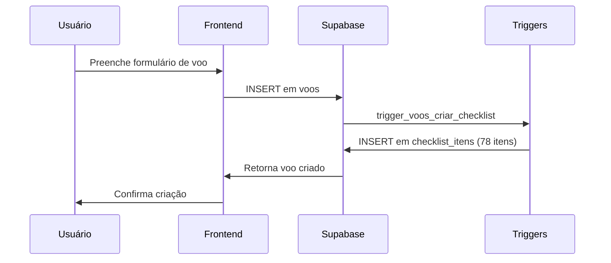
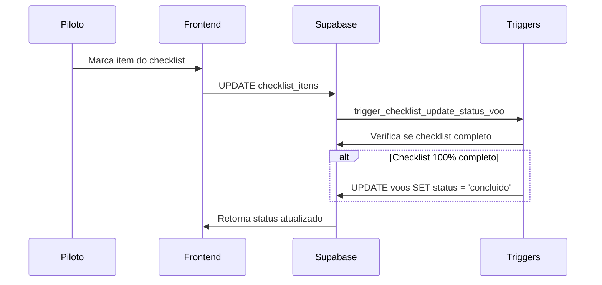
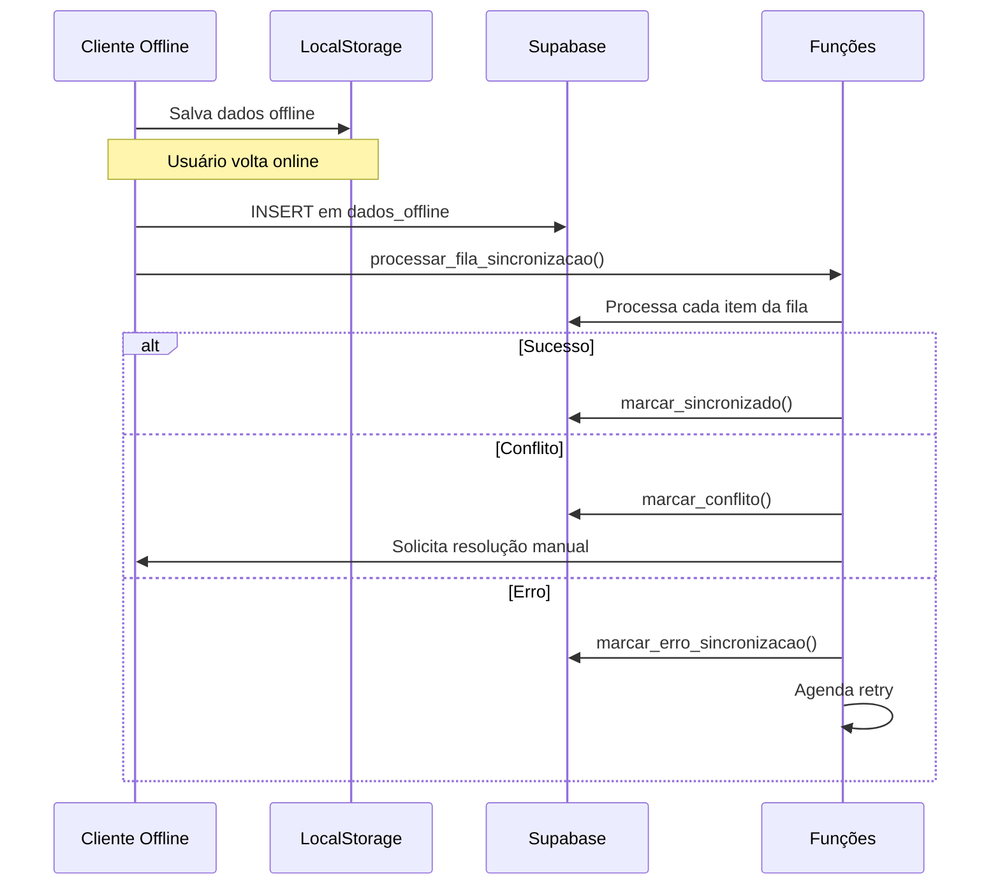
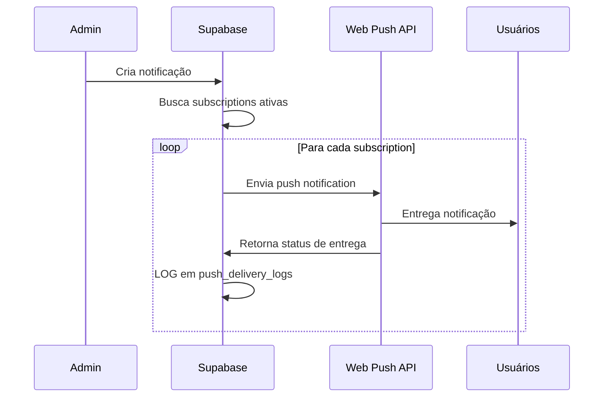

# 📊 Documentação Completa do Banco de Dados Supabase - Sistema AVIBAQ

**Projeto:** AVIBAQ (Associação de Pilotos e Empresas de Balonismo)  
**Banco:** PostgreSQL 17.4 no Supabase  
**ID do Projeto:** elcbodhxzvoqpzamgown  
**Data:** Janeiro 2025  
**Versão:** 1.0

---

## 🎯 Visão Geral do Sistema

O sistema AVIBAQ é uma plataforma completa para gerenciamento de operações de balonismo, construída sobre o Supabase (PostgreSQL). O banco de dados foi projetado para suportar:

- **Gestão de Voos**: Planejamento, execução e controle de voos de balão
- **Sistema de Checklist**: Verificações de segurança obrigatórias
- **Gerenciamento de Membros**: Pilotos, agências e associados
- **Controle de Balões**: Frota e disponibilidade
- **Sistema PWA Offline**: Sincronização de dados offline
- **Push Notifications**: Notificações em tempo real
- **CMS Integrado**: Gestão de conteúdo
- **Auditoria Completa**: Logs de todas as operações

---

## 🏗️ Arquitetura do Banco de Dados

### Estatísticas Gerais
- **Total de Tabelas:** 20
- **Total de Funções:** 65+
- **Total de Triggers:** 25+
- **Total de Políticas RLS:** 50+
- **Extensões PostgreSQL:** 6

### Principais Módulos
1. **Autenticação e Usuários** (`users`, `user_permissions`)
2. **Gestão de Membros** (`membros`, `vinculos_agencia_piloto`)
3. **Operações de Voo** (`voos`, `baloes`, `checklist_itens`)
4. **Sistema de Notificações** (`push_notifications`, `push_subscriptions`)
5. **Funcionalidade Offline** (`dados_offline`)
6. **CMS e Conteúdo** (`boletins`, `paginas_cms`)
7. **Auditoria e Logs** (`logs_atividade`, `permission_audit_log`)

---

## 📋 Esquema Completo das Tabelas

### 1. **Autenticação e Usuários**

#### `users` (79 registros)
**Propósito:** Tabela principal de usuários integrada com Supabase Auth

| Campo | Tipo | Descrição |
|-------|------|----------|
| `id` | uuid | Chave primária (mesmo ID do auth.users) |
| `auth_id` | uuid | Referência ao auth.users |
| `email` | text | Email único do usuário |
| `username` | text | Nome de usuário único |
| `role` | text | Papel do usuário (admin, piloto, agencia) |
| `nome` | text | Nome completo |
| `migrated_at` | timestamptz | Data de migração para Supabase Auth |
| `whatsapp_group_joined` | boolean | Status do grupo WhatsApp |
| `whatsapp_modal_shown` | boolean | Controle de modal WhatsApp |

**Índices:**
- `users_email_key` (único)
- `users_username_key` (único)
- `idx_users_auth_id`

#### `user_permissions` (0 registros)
**Propósito:** Permissões específicas por usuário

| Campo | Tipo | Descrição |
|-------|------|----------|
| `id` | uuid | Chave primária |
| `user_id` | uuid | FK para users |
| `recurso` | text | Recurso do sistema |
| `acao` | text | Ação permitida |
| `permitido` | boolean | Se a permissão está ativa |

### 2. **Gestão de Membros**

#### `membros` (79 registros)
**Propósito:** Cadastro de pilotos, agências e associados

| Campo | Tipo | Descrição |
|-------|------|----------|
| `id` | uuid | Chave primária |
| `user_id` | uuid | FK para users (opcional) |
| `nome_completo` | text | Nome completo do membro |
| `email` | text | Email único |
| `tipo` | membro_tipo | piloto, agencia, associado |
| `status` | membro_status | ativo, inativo, pendente |
| `pagto_inscricao` | membro_pagto_inscricao | aguardando, ok |
| `documento_identidade` | text | CPF/CNPJ |
| `telefone` | text | Telefone de contato |
| `endereco_completo` | text | Endereço completo |
| `data_nascimento` | date | Data de nascimento |
| `observacoes` | text | Observações gerais |

**Relacionamentos:**
- `user_id` → `users.id`

**Índices:**
- `membros_email_key` (único)
- `idx_membros_user_id`
- `idx_membros_tipo`
- `idx_membros_status`

#### `vinculos_agencia_piloto` (4 registros)
**Propósito:** Relacionamento entre agências e pilotos contratados

| Campo | Tipo | Descrição |
|-------|------|----------|
| `id` | uuid | Chave primária |
| `agencia_id` | uuid | FK para membros (tipo agencia) |
| `piloto_id` | uuid | FK para membros (tipo piloto) |
| `status` | vinculo_status | pendente, ativo, inativo |
| `observacoes` | text | Observações do vínculo |
| `convite_enviado_em` | timestamptz | Data do convite |
| `respondido_em` | timestamptz | Data da resposta |

### 3. **Operações de Voo**

#### `baloes` (12 registros)
**Propósito:** Cadastro da frota de balões

| Campo | Tipo | Descrição |
|-------|------|----------|
| `id` | uuid | Chave primária |
| `prefixo` | text | Prefixo único do balão (ex: PP-XYZ) |
| `modelo` | text | Modelo do balão |
| `volume` | integer | Volume em m³ |
| `proprietario_id` | uuid | FK para membros |
| `ativo` | boolean | Se o balão está ativo |
| `observacoes` | text | Observações técnicas |

**Relacionamentos:**
- `proprietario_id` → `membros.id`

**Índices:**
- `baloes_prefixo_key` (único)
- `idx_baloes_ativo`
- `idx_baloes_proprietario`

#### `voos` (36 registros)
**Propósito:** Registro de voos planejados e executados

| Campo | Tipo | Descrição |
|-------|------|----------|
| `id` | uuid | Chave primária |
| `balao_id` | uuid | FK para baloes |
| `piloto_id` | uuid | FK para membros |
| `data_voo` | date | Data do voo |
| `periodo` | voo_periodo | manha, tarde, noite |
| `local_decolagem` | text | Local de decolagem |
| `local_pouso` | text | Local de pouso |
| `duracao_minutos` | integer | Duração em minutos |
| `altitude_maxima` | integer | Altitude máxima em pés |
| `condicoes_meteorologicas` | text | Condições do tempo |
| `observacoes` | text | Observações do voo |
| `status` | voo_status | planejado, em_andamento, concluido, cancelado |
| `created_by` | uuid | FK para users (quem criou) |

**Relacionamentos:**
- `balao_id` → `baloes.id`
- `piloto_id` → `membros.id`
- `created_by` → `users.id`

**Índices:**
- `idx_voos_data`
- `idx_voos_status`
- `idx_voos_piloto`
- `idx_voos_balao`

#### `checklist_itens` (468 registros)
**Propósito:** Itens de checklist de segurança por voo

| Campo | Tipo | Descrição |
|-------|------|----------|
| `id` | uuid | Chave primária |
| `voo_id` | uuid | FK para voos |
| `bloco` | integer | Número do bloco (1-6) |
| `item_numero` | integer | Número do item no bloco |
| `descricao` | text | Descrição do item |
| `marcado` | boolean | Se foi verificado |
| `motivo_nao_marcado` | text | Motivo se não marcado |
| `observacoes` | text | Observações do item |
| `marcado_em` | timestamptz | Quando foi marcado |
| `marcado_por` | uuid | FK para users |
| `preenchido_por` | uuid | FK para users |

**Relacionamentos:**
- `voo_id` → `voos.id`
- `marcado_por` → `users.id`
- `preenchido_por` → `users.id`

**Índices:**
- `unique_voo_bloco_item` (único composto)
- `idx_checklist_voo`
- `idx_checklist_bloco`
- `idx_checklist_marcado`

#### `voos_anexos` (0 registros)
**Propósito:** Anexos de voos (fotos, logs, documentos)

| Campo | Tipo | Descrição |
|-------|------|----------|
| `id` | uuid | Chave primária |
| `voo_id` | uuid | FK para voos |
| `tipo` | tipo_anexo | track_log, foto_voo, regulamento_assinado |
| `nome_arquivo` | text | Nome original do arquivo |
| `caminho_storage` | text | Caminho no Supabase Storage |
| `tamanho_bytes` | bigint | Tamanho do arquivo |
| `mime_type` | text | Tipo MIME |
| `uploaded_by` | uuid | FK para users |

### 4. **Sistema de Notificações**

#### `push_notifications` (9 registros)
**Propósito:** Notificações push enviadas

| Campo | Tipo | Descrição |
|-------|------|----------|
| `id` | uuid | Chave primária |
| `title` | text | Título da notificação |
| `body` | text | Corpo da mensagem |
| `data` | jsonb | Dados adicionais |
| `target_type` | text | Tipo de alvo (all, user, role) |
| `target_value` | text | Valor do alvo |
| `status` | text | Status do envio |
| `sent_count` | integer | Quantas foram enviadas |
| `failed_count` | integer | Quantas falharam |
| `created_by` | uuid | FK para users |

#### `push_subscriptions` (9 registros)
**Propósito:** Inscrições de push notifications dos usuários

| Campo | Tipo | Descrição |
|-------|------|----------|
| `id` | uuid | Chave primária |
| `user_id` | uuid | FK para users |
| `endpoint` | text | Endpoint do push service |
| `p256dh_key` | text | Chave de criptografia |
| `auth_key` | text | Chave de autenticação |
| `user_agent` | text | User agent do navegador |
| `is_active` | boolean | Se está ativa |

#### `push_delivery_logs` (9 registros)
**Propósito:** Logs de entrega de notificações

| Campo | Tipo | Descrição |
|-------|------|----------|
| `id` | uuid | Chave primária |
| `notification_id` | uuid | FK para push_notifications |
| `subscription_id` | uuid | FK para push_subscriptions |
| `user_id` | uuid | FK para users |
| `delivery_status` | varchar(20) | Status da entrega |
| `http_status` | integer | Código HTTP de resposta |
| `error_message` | text | Mensagem de erro |
| `push_service_response` | jsonb | Resposta do serviço |
| `clicked_at` | timestamptz | Quando foi clicada |

### 5. **Funcionalidade Offline (PWA)**

#### `dados_offline` (0 registros)
**Propósito:** Fila de sincronização para funcionalidade offline

| Campo | Tipo | Descrição |
|-------|------|----------|
| `id` | uuid | Chave primária |
| `user_id` | uuid | FK para users |
| `tipo_dados` | tipo_dados_offline | voo, checklist, anexo, balao, vinculo |
| `dados_json` | jsonb | Dados completos em JSON |
| `operacao` | text | CREATE, UPDATE, DELETE |
| `status` | status_sync | pendente, sincronizado, erro |
| `tentativas_sync` | integer | Número de tentativas |
| `max_tentativas` | integer | Máximo de tentativas (padrão: 5) |
| `ultimo_erro` | text | Última mensagem de erro |
| `erro_detalhado` | jsonb | Detalhes do erro |
| `temp_id` | uuid | ID temporário do cliente |
| `real_id` | uuid | ID real após sincronização |
| `conflito_detectado` | boolean | Se há conflito |
| `dados_servidor` | jsonb | Dados do servidor em conflito |

**Índices:**
- `idx_dados_offline_user`
- `idx_dados_offline_status`
- `idx_dados_offline_tipo`
- `idx_dados_offline_pendentes`

### 6. **CMS e Conteúdo**

#### `boletins` (36 registros)
**Propósito:** Boletins meteorológicos publicados

| Campo | Tipo | Descrição |
|-------|------|----------|
| `id` | uuid | Chave primária |
| `titulo` | text | Título do boletim |
| `conteudo` | text | Conteúdo em HTML |
| `data_publicacao` | date | Data de publicação |
| `periodo` | boletim_periodo | manha, tarde, geral |
| `publicado` | boolean | Se está publicado |
| `created_by` | uuid | FK para users |

**Índices:**
- `idx_boletins_data`
- `idx_boletins_periodo`
- `idx_boletins_publicado`

#### `paginas_cms` (6 registros)
**Propósito:** Páginas do CMS (política, termos, etc.)

| Campo | Tipo | Descrição |
|-------|------|----------|
| `id` | uuid | Chave primária |
| `slug` | text | Slug único da página |
| `titulo` | text | Título da página |
| `conteudo` | text | Conteúdo em HTML |
| `ativa` | boolean | Se está ativa |
| `updated_by` | uuid | FK para usuarios_admin |

### 7. **Auditoria e Logs**

#### `logs_atividade` (0 registros)
**Propósito:** Log de atividades do sistema

| Campo | Tipo | Descrição |
|-------|------|----------|
| `id` | uuid | Chave primária |
| `user_id` | uuid | FK para users |
| `acao` | text | Ação realizada |
| `tabela_afetada` | text | Tabela modificada |
| `registro_id` | uuid | ID do registro afetado |
| `dados_anteriores` | jsonb | Dados antes da mudança |
| `dados_novos` | jsonb | Dados após a mudança |
| `ip_address` | inet | IP do usuário |
| `user_agent` | text | User agent |

#### `permission_audit_log` (4 registros)
**Propósito:** Log de auditoria para mudanças de permissões

| Campo | Tipo | Descrição |
|-------|------|----------|
| `id` | bigint | Chave primária |
| `admin_user_id` | uuid | FK para users (admin) |
| `target_user_id` | uuid | FK para users (alvo) |
| `action` | text | Ação realizada |
| `permission_type` | text | Tipo de permissão |
| `recurso` | text | Recurso afetado |
| `acao` | text | Ação da permissão |
| `old_value` | jsonb | Valor anterior |
| `new_value` | jsonb | Novo valor |
| `reason` | text | Motivo da mudança |
| `ip_address` | inet | IP do admin |
| `user_agent` | text | User agent |

### 8. **Tabelas Auxiliares**

#### `assinantes` (79 registros)
**Propósito:** Lista de assinantes do boletim

| Campo | Tipo | Descrição |
|-------|------|----------|
| `id` | uuid | Chave primária |
| `nome` | text | Nome do assinante |
| `email` | text | Email único |
| `eh_piloto` | boolean | Se é piloto |
| `ativo` | boolean | Se está ativo |
| `confirmado` | boolean | Se confirmou email |
| `token_confirmacao` | text | Token de confirmação |
| `token_descadastro` | text | Token de descadastro |

#### `permissoes` (120 registros)
**Propósito:** Permissões por role do sistema

| Campo | Tipo | Descrição |
|-------|------|----------|
| `id` | uuid | Chave primária |
| `role` | text | Papel (admin, piloto, agencia) |
| `recurso` | text | Recurso do sistema |
| `acao` | text | Ação permitida |
| `permitido` | boolean | Se está permitida |

#### `usuarios_admin` (2 registros)
**Propósito:** Usuários administrativos do CMS

| Campo | Tipo | Descrição |
|-------|------|----------|
| `id` | uuid | Chave primária |
| `email` | text | Email único |
| `senha_hash` | text | Hash da senha |
| `nome` | text | Nome completo |
| `perfil` | perfil_usuario | administrador, editor |
| `ativo` | boolean | Se está ativo |

---

## 🔐 Sistema de Segurança (RLS)

### Políticas Row Level Security

O sistema implementa um robusto sistema de RLS com mais de 50 políticas ativas:

#### **Tabela `baloes`**
- **Admins podem ver todos os balões**: `is_admin_user()`
- **Agências podem ver balões de pilotos contratados**: Através de `vinculos_agencia_piloto`
- **Pilotos podem gerenciar seus próprios balões**: `is_owner_or_admin(proprietario_id)`
- **Usuários autenticados podem ver balões ativos**: Para consulta geral

#### **Tabela `voos`**
- **Admins têm acesso total**: `is_admin_user()`
- **Pilotos podem gerenciar seus voos**: `is_owner_or_admin(piloto_id)`
- **Agências podem ver voos de pilotos contratados**: Via `vinculos_agencia_piloto`
- **Criadores podem editar**: `created_by = auth.uid()`

#### **Tabela `checklist_itens`**
- **Acesso baseado no voo**: Herda permissões da tabela `voos`
- **Pilotos podem preencher checklists de seus voos**
- **Admins podem ver todos os checklists**

#### **Tabela `membros`**
- **Admins podem gerenciar todos**: `is_admin_user()`
- **Usuários podem ver seus próprios dados**: `user_id = auth.uid()`
- **Agências podem ver pilotos contratados**: Via `vinculos_agencia_piloto`

#### **Tabela `push_notifications`**
- **Apenas admins podem criar**: `is_admin_user()`
- **Usuários podem ver notificações direcionadas a eles**

### Funções de Segurança

#### **Funções de Verificação de Propriedade**
```sql
-- Verifica se usuário é admin
is_admin_user() -> boolean

-- Verifica se usuário é dono ou admin
is_owner_or_admin(owner_id uuid) -> boolean

-- Verifica se usuário é membro/dono
is_user_member_owner(membro_id uuid) -> boolean

-- Verifica permissões específicas
user_has_permission(p_user_id uuid, p_recurso text, p_acao text) -> boolean
```

#### **Funções de Validação**
```sql
-- Valida prefixo de balão
validar_prefixo_balao(prefixo text) -> boolean

-- Verifica disponibilidade de balão
verificar_disponibilidade_balao(p_balao_id uuid, p_data_voo date, p_periodo voo_periodo) -> boolean

-- Valida tipos de arquivo
validar_tipo_arquivo(p_tipo tipo_anexo, p_mime_type text, p_nome_arquivo text) -> boolean
```

---

## ⚙️ Funções e Triggers

### Principais Funções do Sistema

#### **Gestão de Usuários**
- `get_user_by_auth_id(p_auth_id uuid)`: Busca usuário por auth_id
- `get_user_combined_permissions(p_user_id uuid)`: Permissões combinadas
- `debug_admin_check()`: Debug de verificações de admin

#### **Sincronização Offline**
- `processar_fila_sincronizacao(p_user_id uuid, p_limite integer)`: Processa fila offline
- `marcar_sincronizado(p_item_id uuid, p_real_id uuid)`: Marca como sincronizado
- `resolver_conflito(p_item_id uuid, p_usar_servidor boolean)`: Resolve conflitos
- `marcar_conflito(p_item_id uuid, p_dados_servidor jsonb)`: Marca conflito
- `limpar_dados_sincronizados(p_dias_retencao integer)`: Limpeza automática

#### **Gestão de Anexos**
- `obter_url_anexo_assinada(p_anexo_id uuid, p_duracao_segundos integer)`: URLs assinadas
- `cleanup_storage_files()`: Limpeza de arquivos órfãos

#### **Validações de Negócio**
- `validar_dados_voo()`: Validação completa de voos
- `validar_motivo_checklist()`: Validação de checklist
- `validar_tipos_membros_voos()`: Validação de tipos de membro

### Triggers Principais

#### **Triggers de Negócio**
```sql
-- Auto-criação de checklist ao criar voo
CREATE TRIGGER trigger_voos_criar_checklist
    AFTER INSERT ON voos
    FOR EACH ROW
    EXECUTE FUNCTION trigger_criar_checklist_automatico();

-- Atualização de status do voo baseado no checklist
CREATE TRIGGER trigger_checklist_update_status_voo
    AFTER UPDATE ON checklist_itens
    FOR EACH ROW
    EXECUTE FUNCTION trigger_checklist_update_status_voo();

-- Validação de balões
CREATE TRIGGER trigger_validar_balao
    BEFORE INSERT OR UPDATE ON baloes
    FOR EACH ROW
    EXECUTE FUNCTION trigger_validar_balao();
```

#### **Triggers de Sistema**
```sql
-- Atualização automática de timestamps
CREATE TRIGGER update_users_updated_at
    BEFORE UPDATE ON users
    FOR EACH ROW
    EXECUTE FUNCTION update_updated_at_column();

-- Auditoria de permissões
CREATE TRIGGER user_permissions_audit
    AFTER INSERT OR UPDATE OR DELETE ON user_permissions
    FOR EACH ROW
    EXECUTE FUNCTION log_permission_change();

-- Limpeza de storage ao deletar anexos
CREATE TRIGGER trigger_anexos_cleanup_storage
    AFTER DELETE ON voos_anexos
    FOR EACH ROW
    EXECUTE FUNCTION trigger_anexos_cleanup_storage();
```

---

## 🔗 Integração com o Código Frontend

### Configuração do Cliente Supabase

```typescript
// src/integrations/supabase/client.ts
import { createClient } from '@supabase/supabase-js';
import type { Database } from './types';

const SUPABASE_URL = process.env.NEXT_PUBLIC_SUPABASE_URL;
const SUPABASE_PUBLISHABLE_KEY = process.env.NEXT_PUBLIC_SUPABASE_ANON_KEY;

export const supabase = createClient<Database>(
  SUPABASE_URL,
  SUPABASE_PUBLISHABLE_KEY
);
```

### Hooks Principais

#### **useUser Hook**
```typescript
// src/hooks/useUser.ts
export function useUser() {
  const [user, setUser] = useState(null);
  const [role, setRole] = useState(null);
  const [loading, setLoading] = useState(true);

  // Busca usuário por auth_id (otimizado) ou email (fallback)
  const fetchUser = useCallback(async () => {
    const { data: { user } } = await supabase.auth.getUser();
    
    if (user) {
      // Tenta busca otimizada por auth_id
      let userData = await supabase.rpc('get_user_by_auth_id', { 
        p_auth_id: user.id 
      });
      
      // Fallback para busca por email
      if (!userData.data) {
        userData = await supabase
          .from("users")
          .select("*")
          .eq("email", user.email)
          .single();
      }
      
      setUser({ ...user, ...userData.data });
      setRole(userData.data?.role);
    }
  }, []);

  return { user, role, loading };
}
```

#### **usePermissions Hook**
```typescript
// src/hooks/usePermissions.ts
export function usePermissions() {
  const { user } = useUser();
  const [permissions, setPermissions] = useState<Permission[]>([]);

  const fetchPermissions = useCallback(async (userId: string) => {
    const { data } = await supabase.rpc('get_user_combined_permissions', {
      p_user_id: userId
    });
    return data || [];
  }, []);

  const hasPermission = useCallback((recurso: string, acao: string) => {
    if (user?.role === 'admin') return true;
    
    return permissions.some(p => 
      p.recurso === recurso && 
      p.acao === acao && 
      p.permitido
    );
  }, [user, permissions]);

  return { permissions, hasPermission, loading };
}
```

### Padrões de Query

#### **Queries com RLS**
```typescript
// Buscar voos do usuário (RLS automático)
const { data: voos } = await supabase
  .from('voos')
  .select(`
    *,
    balao:baloes(*),
    piloto:membros(*),
    checklist_itens(*)
  `)
  .order('data_voo', { ascending: false });

// Buscar balões disponíveis
const { data: baloes } = await supabase
  .from('baloes')
  .select('*')
  .eq('ativo', true)
  .order('prefixo');
```

#### **Mutations com Validação**
```typescript
// Criar voo com validação automática
const { data: novoVoo, error } = await supabase
  .from('voos')
  .insert({
    balao_id: formData.balao_id,
    piloto_id: membro.id,
    data_voo: formData.data_voo,
    periodo: formData.periodo,
    local_decolagem: formData.local_decolagem,
    created_by: user.id
  })
  .select()
  .single();

// Checklist é criado automaticamente via trigger
```

#### **Funcionalidade Offline**
```typescript
// Adicionar à fila offline
const adicionarFilaOffline = async (dados: any, operacao: string) => {
  await supabase
    .from('dados_offline')
    .insert({
      user_id: user.id,
      tipo_dados: 'voo',
      dados_json: dados,
      operacao: operacao,
      temp_id: crypto.randomUUID()
    });
};

// Processar fila de sincronização
const sincronizarDados = async () => {
  const { data } = await supabase.rpc('processar_fila_sincronizacao', {
    p_user_id: user.id,
    p_limite: 10
  });
  
  for (const item of data) {
    // Processar cada item da fila
    await processarItemSincronizacao(item);
  }
};
```

---

## 📱 Sistema PWA e Offline

### Arquitetura Offline

O sistema implementa uma arquitetura robusta para funcionalidade offline:

#### **Tabela `dados_offline`**
- **Fila de Sincronização**: Armazena operações realizadas offline
- **Controle de Conflitos**: Detecta e resolve conflitos de dados
- **Retry Automático**: Sistema de tentativas com backoff exponencial
- **Limpeza Automática**: Remove dados sincronizados após período de retenção

#### **Fluxo de Sincronização**
1. **Offline**: Dados salvos em `dados_offline` com `temp_id`
2. **Online**: Processamento via `processar_fila_sincronizacao()`
3. **Conflito**: Detecção e resolução via `resolver_conflito()`
4. **Sucesso**: Marcação via `marcar_sincronizado()`
5. **Limpeza**: Remoção via `limpar_dados_sincronizados()`

### Push Notifications

#### **Arquitetura de Notificações**
- **Subscriptions**: Gerenciamento de inscrições por usuário/dispositivo
- **Targeting**: Notificações para usuários específicos, roles ou broadcast
- **Delivery Tracking**: Log completo de entregas e cliques
- **Retry Logic**: Reenvio automático para falhas temporárias

#### **Tipos de Notificação**
- **Voo Criado**: Notifica pilotos sobre novos voos
- **Checklist Pendente**: Lembra sobre checklists não preenchidos
- **Boletim Publicado**: Informa sobre novos boletins meteorológicos
- **Sistema**: Notificações administrativas

---

## 🔧 Extensões PostgreSQL

### Extensões Ativas

1. **`uuid-ossp`**: Geração de UUIDs para chaves primárias
2. **`pg_graphql`**: Suporte a GraphQL API automática
3. **`pgcrypto`**: Funções criptográficas para hashing
4. **`pg_stat_statements`**: Análise de performance de queries
5. **`supabase_vault`**: Gerenciamento seguro de secrets
6. **`plpgsql`**: Linguagem procedural para funções

### Tipos Customizados (ENUMs)

```sql
-- Tipos de membro
CREATE TYPE membro_tipo AS ENUM ('piloto', 'agencia', 'associado');

-- Status de membro
CREATE TYPE membro_status AS ENUM ('ativo', 'inativo', 'pendente');

-- Status de pagamento
CREATE TYPE membro_pagto_inscricao AS ENUM ('aguardando', 'ok');

-- Períodos de voo
CREATE TYPE voo_periodo AS ENUM ('manha', 'tarde', 'noite');

-- Status de voo
CREATE TYPE voo_status AS ENUM ('planejado', 'em_andamento', 'concluido', 'cancelado');

-- Tipos de anexo
CREATE TYPE tipo_anexo AS ENUM ('track_log', 'foto_voo', 'regulamento_assinado');

-- Status de sincronização
CREATE TYPE status_sync AS ENUM ('pendente', 'sincronizado', 'erro');

-- Tipos de dados offline
CREATE TYPE tipo_dados_offline AS ENUM ('voo', 'checklist', 'anexo', 'balao', 'vinculo');

-- Status de vínculo
CREATE TYPE vinculo_status AS ENUM ('pendente', 'ativo', 'inativo');

-- Perfil de usuário admin
CREATE TYPE perfil_usuario AS ENUM ('administrador', 'editor');

-- Período de boletim
CREATE TYPE boletim_periodo AS ENUM ('manha', 'tarde', 'geral');
```

---

## 📊 Índices e Otimizações

### Índices de Performance

#### **Chaves Estrangeiras**
Todos os relacionamentos possuem índices automáticos:
- `idx_membros_user_id`
- `idx_voos_piloto`
- `idx_voos_balao`
- `idx_checklist_voo`

#### **Filtros Comuns**
- `idx_baloes_ativo`: Filtro por balões ativos
- `idx_membros_status`: Filtro por status de membro
- `idx_voos_status`: Filtro por status de voo
- `idx_voos_data`: Ordenação por data

#### **Sincronização Offline**
- `idx_dados_offline_pendentes`: Itens pendentes de sincronização
- `idx_dados_offline_user_status`: Filtro por usuário e status
- `idx_dados_offline_tipo`: Filtro por tipo de dados

#### **Sistema de Notificações**
- `idx_push_delivery_notification`: Logs por notificação
- `idx_push_subscriptions_user`: Inscrições por usuário

### Otimizações de Query

#### **Queries Complexas Otimizadas**
```sql
-- Busca de voos com relacionamentos (otimizada)
SELECT 
  v.*,
  b.prefixo as balao_prefixo,
  m.nome_completo as piloto_nome,
  COUNT(ci.id) as total_checklist,
  COUNT(CASE WHEN ci.marcado THEN 1 END) as checklist_completo
FROM voos v
JOIN baloes b ON v.balao_id = b.id
JOIN membros m ON v.piloto_id = m.id
LEFT JOIN checklist_itens ci ON v.id = ci.voo_id
WHERE v.data_voo >= CURRENT_DATE
GROUP BY v.id, b.prefixo, m.nome_completo
ORDER BY v.data_voo, v.periodo;
```

---

## 🚀 Fluxos de Dados Principais

### 1. Fluxo de Cadastro de Voo



### 2. Fluxo de Checklist



### 3. Fluxo de Sincronização Offline



### 4. Fluxo de Push Notifications



---

## 🔍 Monitoramento e Debug

### Funções de Debug

```sql
-- Debug de verificações de admin
SELECT debug_admin_check();

-- Debug de acesso de piloto
SELECT debug_pilot_access();

-- Teste de políticas de balão
SELECT test_balao_policy();

-- Teste de inserção real
SELECT test_insert_real('PP', 1000, 'Teste', 'Observação');
```

### Queries de Monitoramento

```sql
-- Estatísticas de voos por status
SELECT 
  status,
  COUNT(*) as total,
  COUNT(*) * 100.0 / SUM(COUNT(*)) OVER() as percentual
FROM voos 
GROUP BY status;

-- Checklist completion rate
SELECT 
  v.id,
  v.data_voo,
  COUNT(ci.id) as total_itens,
  COUNT(CASE WHEN ci.marcado THEN 1 END) as itens_marcados,
  ROUND(
    COUNT(CASE WHEN ci.marcado THEN 1 END) * 100.0 / COUNT(ci.id), 
    2
  ) as percentual_completo
FROM voos v
LEFT JOIN checklist_itens ci ON v.id = ci.voo_id
GROUP BY v.id, v.data_voo
ORDER BY v.data_voo DESC;

-- Dados pendentes de sincronização
SELECT 
  tipo_dados,
  status,
  COUNT(*) as total,
  AVG(tentativas_sync) as media_tentativas
FROM dados_offline
GROUP BY tipo_dados, status;

-- Performance de notificações
SELECT 
  pn.title,
  pn.sent_count,
  pn.failed_count,
  ROUND(
    pn.sent_count * 100.0 / (pn.sent_count + pn.failed_count), 
    2
  ) as taxa_sucesso
FROM push_notifications pn
WHERE pn.sent_count + pn.failed_count > 0
ORDER BY pn.created_at DESC;
```

---

## 🛠️ Manutenção e Limpeza

### Rotinas de Limpeza Automática

```sql
-- Limpeza de dados offline sincronizados (7 dias)
SELECT limpar_dados_sincronizados(7);

-- Limpeza de logs antigos (30 dias)
DELETE FROM logs_atividade 
WHERE created_at < NOW() - INTERVAL '30 days';

-- Limpeza de delivery logs antigos (90 dias)
DELETE FROM push_delivery_logs 
WHERE created_at < NOW() - INTERVAL '90 days';

-- Limpeza de subscriptions inativas (180 dias)
DELETE FROM push_subscriptions 
WHERE is_active = false 
AND updated_at < NOW() - INTERVAL '180 days';
```

### Backup e Restore

```bash
# Backup completo
pg_dump -h db.elcbodhxzvoqpzamgown.supabase.co \
        -U postgres \
        -d postgres \
        --no-owner --no-privileges \
        > avibaq_backup_$(date +%Y%m%d).sql

# Backup apenas dados
pg_dump -h db.elcbodhxzvoqpzamgown.supabase.co \
        -U postgres \
        -d postgres \
        --data-only \
        > avibaq_data_$(date +%Y%m%d).sql
```

---

## 📈 Métricas e KPIs

### Métricas de Negócio

- **Voos por Mês**: Crescimento da atividade
- **Taxa de Conclusão de Checklist**: Segurança operacional
- **Membros Ativos**: Engajamento da comunidade
- **Balões Cadastrados**: Crescimento da frota
- **Boletins Publicados**: Frequência de comunicação

### Métricas Técnicas

- **Tempo de Resposta**: Performance das queries
- **Taxa de Sincronização Offline**: Eficiência PWA
- **Entrega de Notificações**: Eficácia do sistema push
- **Uso de Storage**: Crescimento de anexos
- **Erros de RLS**: Problemas de segurança

---

## 🔮 Roadmap e Melhorias

### Próximas Funcionalidades

1. **Analytics Avançado**: Dashboard com métricas detalhadas
2. **API GraphQL**: Exposição via pg_graphql
3. **Backup Automático**: Rotinas de backup agendadas
4. **Alertas Inteligentes**: Notificações baseadas em ML
5. **Integração Meteorológica**: APIs de dados meteorológicos
6. **Mobile App**: Aplicativo nativo complementar

### Otimizações Planejadas

1. **Particionamento**: Tabelas grandes por data
2. **Materialized Views**: Consultas complexas pré-calculadas
3. **Connection Pooling**: Otimização de conexões
4. **Read Replicas**: Distribuição de carga de leitura
5. **Caching Avançado**: Redis para dados frequentes

---

## 📞 Suporte e Contato

### Informações do Projeto
- **Desenvolvedor**: Rafael Carboni
- **Organização**: AVIBAQ
- **Ambiente**: Produção
- **Versão do PostgreSQL**: 17.4
- **Versão do Supabase**: Latest

### Links Úteis
- **Dashboard Supabase**: https://supabase.com/dashboard/project/elcbodhxzvoqpzamgown
- **Aplicação**: https://avibaq.org
- **Repositório**: Privado

---

*Documentação gerada automaticamente em Janeiro 2025*  
*Baseada na análise completa do banco de dados PostgreSQL do projeto AVIBAQ*