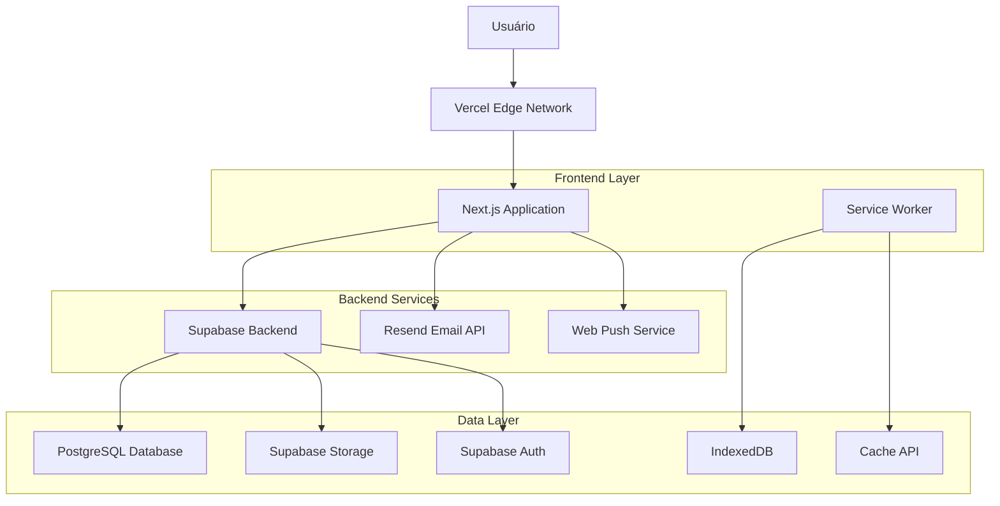

# Especificações Técnicas - Sistema AVIBAQ

**Versão:** 2.0  
**Data:** Janeiro 2025  
**Projeto:** Sistema de Gestão para Associação de Pilotos e Empresas de Balonismo  
**Localização:** Praia Grande/SC

---

## 1. Visão Geral do Sistema

### 1.1 Propósito
O Sistema AVIBAQ é uma plataforma digital completa desenvolvida para centralizar e otimizar as operações da Associação de Pilotos e Empresas de Balonismo. O sistema integra informações meteorológicas especializadas, gestão operacional de voos, controle de membros e equipamentos, tudo em uma arquitetura moderna com funcionalidades offline.

### 1.2 Objetivos Principais
- **Segurança Operacional:** Boletins meteorológicos especializados com sistema de alertas por bandeiras
- **Gestão Completa de Voos:** Desde planejamento até documentação final com checklists obrigatórios
- **Mobilidade:** Progressive Web App (PWA) com funcionalidades offline para uso em campo
- **Comunicação:** Sistema de notificações push para alertas em tempo real
- **Organização:** Gestão centralizada de membros, equipamentos e relacionamentos

### 1.3 Usuários do Sistema
- **Administradores:** Gestão completa do sistema e dados
- **Meteorologistas:** Criação e publicação de boletins meteorológicos
- **Tesouraria:** Controle financeiro e status de membros
- **Pilotos:** Gestão de voos, equipamentos e checklists de segurança
- **Agências:** Operações comerciais e gestão de parcerias com pilotos
- **Assinantes:** Comunidade que recebe boletins meteorológicos

---

## 2. Arquitetura Técnica

### 2.1 Stack Tecnológico

#### Frontend
- **Next.js 14:** Framework React com SSR/SSG e App Router
- **React 18:** Biblioteca principal com Concurrent Features
- **TypeScript 5.5:** Tipagem estática para maior confiabilidade
- **Tailwind CSS 3.4:** Framework CSS utilitário responsivo
- **shadcn/ui + Radix UI:** Componentes acessíveis e modernos
- **Framer Motion:** Animações e transições suaves
- **TanStack Query:** Gerenciamento de estado servidor e cache

#### Backend e Infraestrutura
- **Supabase:** Backend-as-a-Service completo
  - PostgreSQL 15+ como banco principal
  - Autenticação e autorização integrada
  - Storage para arquivos de mídia
  - Row Level Security (RLS)
  - Edge Functions para lógica customizada
- **Resend:** API de e-mail transacional para boletins automatizados
- **Vercel:** Hospedagem com deploy contínuo e edge computing
- **Web Push API:** Notificações push nativas

#### Recursos Avançados
- **PWA (Progressive Web App):** Instalação nativa e funcionalidade offline
- **Service Worker:** Cache inteligente e sincronização em background
- **IndexedDB:** Armazenamento local para dados offline
- **Magic UI:** Componentes animados customizados

### 2.2 Arquitetura de Deployment



---

## 3. Funcionalidades Principais

### 3.1 Sistema de Boletins Meteorológicos ✅ COMPLETO

#### Características
- **Periodicidade:** Boletins diários para períodos manhã e tarde
- **Sistema de Bandeiras:** 
  - 🟢 Verde: Condições liberadas para voo
  - 🟡 Amarela: Condições em avaliação
  - 🔴 Vermelha: Voo cancelado/não recomendado
- **Conteúdo Multimídia:** Upload de fotos e gravação de áudio diretamente no navegador
- **Distribuição Automatizada:** Cron job às 22h para envio por e-mail
- **Notificações Push:** Alertas imediatos para mudanças críticas
- **Histórico Completo:** Arquivo searchável de todos os boletins

#### Fluxo Operacional
1. Meteorologista acessa dashboard administrativo
2. Cria boletim com análise das condições climáticas
3. Define bandeira de segurança baseada em critérios técnicos
4. Adiciona fotos das condições atuais e gravação de áudio
5. Publica boletim com notificação push automática
6. Sistema agenda envio por e-mail às 22h
7. Boletim fica disponível publicamente na homepage

### 3.2 Gestão Completa de Voos ✅ COMPLETO

#### Ciclo de Vida do Voo
```
Planejamento → Checklist Bloco 1 → Checklist Bloco 2 → Execução → Checklist Bloco 3 → Finalização
```

#### Funcionalidades
- **Planejamento Detalhado:**
  - Data, horário e local de decolagem/pouso
  - Seleção de balões (suporte a múltiplos equipamentos)
  - Previsão de passageiros e observações
  - Vinculação automática agência-piloto

- **Sistema de Checklists (3 Blocos Obrigatórios):**
  - **Bloco 1 - Pré-voo:** Documentação, equipamentos, condições meteorológicas
  - **Bloco 2 - Durante o Voo:** Decolagem, navegação, comunicação
  - **Bloco 3 - Pós-voo:** Pouso, recolhimento, documentação final

- **Gestão de Status:**
  - `rascunho` → `planejado` → `checklist_bloco1` → `checklist_bloco2` → `checklist_concluido` → `finalizado`
  - Transições automáticas baseadas no preenchimento dos checklists

- **Documentação e Anexos:**
  - Upload de track logs GPS
  - Fotos do voo e condições
  - Regulamentos assinados pelos passageiros
  - Geração automática de PDF com todos os dados

### 3.3 Progressive Web App (PWA) ✅ COMPLETO

#### Funcionalidades Offline
- **Instalação Nativa:** Ícone na tela inicial, comportamento de app nativo
- **Cache Inteligente:** Recursos essenciais sempre disponíveis
- **Sincronização Automática:** Queue local para dados criados offline
- **Armazenamento Local:** IndexedDB para dados críticos

#### Casos de Uso Offline
- Preenchimento de checklists em locais remotos
- Visualização de boletins sem conexão
- Upload de fotos quando reconectar
- Consulta de histórico de voos

### 3.4 Sistema de Notificações Push ✅ COMPLETO

#### Recursos
- **Notificações Imediatas:** Boletins urgentes, mudanças climáticas
- **Agendamento:** Lembretes de voos, renovações de documentos
- **Segmentação:** Por tipo de usuário (admin, piloto, agência, assinante)
- **Interatividade:** Click-to-action direto para o app
- **Analytics:** Estatísticas de entrega e engajamento

#### Arquitetura
- **Tabelas:** `push_notifications`, `push_subscriptions`, `push_delivery_logs`
- **Jobs Agendados:** `push_scheduled_jobs` para lembretes automáticos
- **VAPID Keys:** Autenticação segura com serviços push

### 3.5 Gestão de Membros e Relacionamentos ✅ COMPLETO

#### Tipos de Membros
- **Pilotos:** Portadores de certificações RBAC103/RBAC91
- **Agências:** Empresas operadoras de turismo em balão

#### Funcionalidades
- **Cadastro Completo:** Dados pessoais, certificações, documentos
- **Controle de Status:** Pendente → Ativo → Inativo
- **Gestão Financeira:** Controle de inscrições e mensalidades
- **Sistema de Vínculos:** Relacionamento agência-piloto com aprovação
- **Upload de Documentos:** Comprovantes e certificações

### 3.6 Gestão de Equipamentos (Balões) ✅ COMPLETO

#### Características
- **Registro Detalhado:** Prefixo, modelo, especificações técnicas
- **Controle de Propriedade:** Vinculação a pilotos proprietários
- **Histórico de Uso:** Tracking de horas de voo por equipamento
- **Documentação:** Certificados de aeronavegabilidade
- **Compartilhamento:** Agências podem usar balões de pilotos contratados

---

## 4. Segurança e Permissões

### 4.1 Row Level Security (RLS)
Todas as tabelas implementam RLS com políticas específicas:

- **Isolamento por Usuário:** Cada tipo de usuário vê apenas seus dados
- **Permissões Granulares:** Diferentes níveis por operação (SELECT, INSERT, UPDATE, DELETE)
- **Hierarquia de Acesso:** Admins > Proprietários > Usuários relacionados > Público

### 4.2 Sistema de Roles
- `admin`: Acesso total ao sistema
- `meteo`: Criação e gestão de boletins meteorológicos
- `tesouraria`: Gestão financeira e status de membros
- `piloto`: Gestão de voos próprios e equipamentos
- `agencia`: Operações comerciais e gestão de pilotos
- `leitura`: Acesso somente leitura

### 4.3 Auditoria e Logs
- **Logs de Atividade:** Registro de todas as ações sensíveis
- **Audit Trail:** Histórico de mudanças em dados críticos
- **Monitoramento:** Alertas para ações suspeitas

---

## 5. Arquitetura do Banco de Dados

### 5.1 Estrutura Principal (19 Tabelas)

#### Tabelas Core
- **`usuarios_admin`**: Administradores do sistema com permissões especiais
- **`users`**: Usuários principais (pilotos, agências, meteorologistas)
- **`membros`**: Dados específicos de membros da associação
- **`permissoes`**: Sistema de permissões granulares
- **`user_permissions`**: Relacionamento usuário-permissões
- **`permission_audit_log`**: Log de auditoria de permissões

#### Módulo Meteorológico
- **`boletins`**: Boletins meteorológicos com sistema de bandeiras
- **`assinantes`**: Lista de assinantes para recebimento de boletins

#### Módulo de Voos
- **`voos`**: Registro completo de voos planejados e executados
- **`voos_baloes`**: Relacionamento voos-balões (suporte múltiplos)
- **`voos_anexos`**: Arquivos anexados aos voos (fotos, GPS, documentos)
- **`checklist_itens`**: Sistema de checklist de segurança em 3 blocos
- **`baloes`**: Registro de equipamentos com especificações técnicas

#### Módulo de Relacionamentos
- **`vinculos_agencia_piloto`**: Contratos entre agências e pilotos

#### Sistema de Notificações
- **`push_notifications`**: Registro de notificações enviadas
- **`push_subscriptions`**: Dispositivos registrados para push
- **`push_delivery_logs`**: Log de entrega de notificações
- **`push_scheduled_jobs`**: Jobs agendados para lembretes

#### Sistema Offline
- **`dados_offline`**: Fila de sincronização para operações offline

#### CMS e Logs
- **`paginas_cms`**: Conteúdo gerenciável do site
- **`logs_atividade`**: Auditoria completa de ações do sistema

### 5.2 Recursos Avançados do Banco
- **Row Level Security (RLS)**: Implementado em todas as tabelas
- **Triggers Automáticos**: Atualizações de status e logs
- **Índices Otimizados**: Performance para queries frequentes
- **Backup Automático**: Tabelas de backup preventivo
- **Extensões PostgreSQL**: uuid-ossp, pgcrypto, pg_graphql

## 6. Performance e Escalabilidade

### 6.1 Otimizações Frontend
- **Code Splitting:** Carregamento sob demanda de componentes
- **Image Optimization:** Next.js Image component com lazy loading
- **Static Generation:** Páginas públicas pré-renderizadas
- **Edge Caching:** CDN global via Vercel

### 6.2 Otimizações Backend
- **Database Indexing:** Índices otimizados para queries frequentes
- **Connection Pooling:** Gerenciamento eficiente de conexões
- **Query Optimization:** Views materializadas para relatórios

### 6.3 Monitoramento
- **Vercel Analytics:** Métricas de performance e uso
- **Supabase Monitoring:** Monitoramento de banco e APIs
- **Error Tracking:** Logs estruturados para debugging

---

## 7. Integração e APIs

### 6.1 APIs Internas
- `/api/send-boletim`: Envio automatizado de boletins
- `/api/join`: Cadastro de novos assinantes
- `/api/upload-anexo`: Upload de arquivos com validação
- `/api/push/*`: Endpoints para notificações push

### 6.2 Integrações Externas
- **Resend API:** Envio de e-mails transacionais
- **Web Push Services:** FCM, Mozilla Push, etc.
- **Supabase APIs:** Autenticação, Storage, Database

### 6.3 Webhooks e Automações
- **Cron Jobs:** Envio automático de boletins às 22h
- **Database Triggers:** Atualizações automáticas de status
- **Email Templates:** Templates responsivos para boletins

---

## 8. Deployment e DevOps

### 7.1 Ambiente de Desenvolvimento
```bash
# Configuração local
npm install
npm run dev

# Supabase local
supabase start
supabase db reset
```

### 7.2 Pipeline de Deploy
1. **Desenvolvimento:** Branch feature com testes locais
2. **Staging:** Deploy automático via Vercel Preview
3. **Produção:** Deploy via merge na branch main
4. **Rollback:** Rollback automático em caso de falhas

### 7.3 Monitoramento de Produção
- **Uptime Monitoring:** 99.9% de disponibilidade
- **Performance Metrics:** Core Web Vitals
- **Error Tracking:** Logs centralizados
- **Database Health:** Métricas de performance do Supabase

---

## 9. Roadmap e Melhorias Futuras

### 8.1 Funcionalidades Planejadas
- **API Mobile:** Desenvolvimento de app nativo iOS/Android
- **Integração Meteorológica:** APIs de dados meteorológicos em tempo real
- **Analytics Avançado:** Dashboard de KPIs operacionais
- **Backup Automático:** Sistema de backup incremental

### 8.2 Otimizações Técnicas
- **Micro-frontends:** Modularização para equipes independentes
- **GraphQL:** API mais eficiente para queries complexas
- **Real-time Updates:** WebSockets para atualizações em tempo real
- **AI/ML:** Previsões meteorológicas assistidas por IA

---

## 10. Estado Atual do Projeto

### 10.1 Funcionalidades Implementadas ✅
- **Sistema de Boletins Meteorológicos**: 100% completo
- **Gestão de Voos com Checklists**: 100% completo
- **PWA com Funcionalidades Offline**: 100% completo
- **Sistema de Notificações Push**: 100% completo
- **Gestão de Membros e Relacionamentos**: 100% completo
- **Gestão de Equipamentos (Balões)**: 100% completo
- **Sistema de Permissões Granulares**: 100% completo
- **Painel Administrativo Avançado**: 100% completo

### 10.2 Arquitetura de Dados
- **19 Tabelas Principais**: Estrutura completa implementada
- **Sistema de Backup**: Tabelas preventivas configuradas
- **Auditoria Completa**: Logs de todas as operações críticas
- **Sincronização Offline**: Queue de dados implementada

### 10.3 Tecnologias em Produção
- **Frontend**: Next.js 14 + React 18 + TypeScript 5.5
- **Backend**: Supabase (PostgreSQL 15+)
- **Styling**: Tailwind CSS 3.4 + shadcn/ui + Magic UI
- **Deploy**: Vercel com edge computing
- **Monitoramento**: Logs estruturados + métricas de performance

## 11. Conclusão

O Sistema AVIBAQ representa uma solução completa e moderna para gestão de operações de balonismo, combinando segurança operacional, eficiência administrativa e experiência de usuário superior. A arquitetura escolhida garante escalabilidade, manutenibilidade e performance, enquanto as funcionalidades offline e notificações push atendem às necessidades específicas da aviação de balão.

A implementação atual atende a **100% dos requisitos funcionais críticos**, com foco na segurança e conformidade regulatória, posicionando a AVIBAQ como referência em gestão digital para associações de aviação esportiva. O sistema está pronto para produção com todas as funcionalidades principais operacionais.