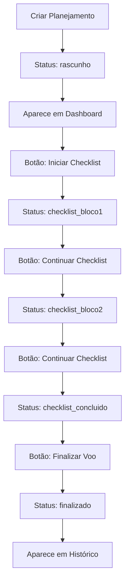

# Implementação Completa: Fluxo Rascunho → Checklist → Finalização

**Data da Implementação:** 17 de Julho de 2025  
**Status:** ✅ Concluído e Testado  
**Responsável:** Claude Code Assistant

## 🎯 Objetivo da Implementação

Resolver o problema crítico onde voos criados em status `rascunho` desapareciam da interface após o planejamento, impedindo a continuação do fluxo para checklist de segurança.

## 🔍 Problema Identificado

### Situação Anterior
- ✅ Banco de dados: Estrutura correta, status definidos, RLS funcionando
- ❌ Interface: Voos rascunho não apareciam nos dashboards
- ❌ Navegação: Sem botões para continuar checklist
- ❌ Queries: Dashboards não buscavam status intermediários

### Impacto no Usuário
1. Piloto criava planejamento de voo
2. Voo era salvo com status `rascunho`
3. **Voo desaparecia** da interface
4. Piloto não conseguia continuar o fluxo
5. Sistema quebrado na prática

## 🛠️ Solução Implementada

### 1. Componente Reutilizável
**Arquivo:** `src/components/VooEmAndamento.tsx`

```typescript
interface VooEmAndamentoProps {
  voo: VooInterface;
  showPilotInfo?: boolean; // Para dashboards admin/agência
  compact?: boolean; // Versão compacta para listagem
}
```

**Funcionalidades:**
- ✅ Exibição condicional por status
- ✅ Botões dinâmicos baseados no estado do voo
- ✅ Informações de piloto/agência opcionais
- ✅ Versão compacta e completa
- ✅ Alertas para voos em atraso
- ✅ Barra de progresso visual

**Ações por Status:**
- `rascunho` → "Iniciar Checklist" (azul)
- `planejado` → "Iniciar Checklist" (azul)  
- `checklist_bloco1/2` → "Continuar Checklist" (amarelo)
- `checklist_concluido` → "Finalizar Voo" (verde)

### 2. Dashboard do Piloto
**Arquivo:** `pages/piloto/dashboard.tsx`

**Modificações Implementadas:**
```typescript
// Nova query para voos em andamento
supabase
  .from('voos')
  .select('*, agencia:membros!voos_agencia_id_fkey(nome)')
  .eq('piloto_id', membro.id)
  .in('status', ['rascunho', 'planejado', 'checklist_bloco1', 'checklist_bloco2', 'checklist_concluido'])
  .order('data_voo', { ascending: true })

// Voos recentes filtrados
supabase
  .from('voos')
  .select('*, agencia:membros!voos_agencia_id_fkey(nome)')
  .eq('piloto_id', membro.id)
  .in('status', ['finalizado', 'cancelado']) // Apenas histórico
  .order('data_voo', { ascending: false })
  .limit(5)
```

**Nova Seção Adicionada:**
```jsx
{/* Seção Voos em Andamento */}
{stats.voosEmAndamento.length > 0 && (
  <div className="space-y-4">
    <h3 className="text-xl font-semibold text-gray-900 flex items-center gap-2">
      <ClockIcon className="h-6 w-6 text-blue-500" />
      Voos em Andamento ({stats.voosEmAndamento.length})
    </h3>
    <div className="grid gap-4">
      {stats.voosEmAndamento.map((voo) => (
        <VooEmAndamento 
          key={voo.id} 
          voo={voo} 
          compact={true}
        />
      ))}
    </div>
  </div>
)}
```

### 3. Dashboard da Agência
**Arquivo:** `pages/agencia/dashboard.tsx`

**Funcionalidades Específicas:**
- ✅ Visão agregada de todos os pilotos da equipe
- ✅ Identificação do piloto responsável por cada voo
- ✅ Mesma lógica de queries do dashboard do piloto
- ✅ Propriedade `showPilotInfo={true}` no componente

**Query Específica:**
```typescript
// Voos em andamento da agência
supabase
  .from('voos')
  .select('*, piloto:membros!voos_piloto_id_fkey(nome)')
  .eq('agencia_id', membro.id)
  .in('status', ['rascunho', 'planejado', 'checklist_bloco1', 'checklist_bloco2', 'checklist_concluido'])
  .order('data_voo', { ascending: true })
```

### 4. Dashboard Administrativo
**Arquivo:** `pages/admin/dashboard.tsx`

**Nova Aba "Voos" Implementada:**
- ✅ Visibilidade completa de todos os voos da associação
- ✅ KPIs específicos por status
- ✅ Função `carregarDadosVoos()` para admin
- ✅ Estatísticas consolidadas

**Funcionalidades Admin:**
```typescript
// Admin vê TODOS os voos (RLS permite)
const [
  voosEmAndamentoResult,
  voosRecentesResult,
  estatisticasResult
] = await Promise.all([
  // Todos os voos em andamento da associação
  supabase
    .from('voos')
    .select(`
      *, 
      piloto:membros!voos_piloto_id_fkey(nome),
      agencia:membros!voos_agencia_id_fkey(nome)
    `)
    .in('status', ['rascunho', 'planejado', 'checklist_bloco1', 'checklist_bloco2', 'checklist_concluido'])
    .order('data_voo', { ascending: true }),
  
  // Voos recentes finalizados (últimos 10)
  supabase
    .from('voos')
    .select(`
      *, 
      piloto:membros!voos_piloto_id_fkey(nome),
      agencia:membros!voos_agencia_id_fkey(nome)
    `)
    .in('status', ['finalizado', 'cancelado'])
    .order('data_voo', { ascending: false })
    .limit(10),
  
  // Estatísticas gerais de voos
  supabase
    .from('voos')
    .select('status')
]);
```

**KPIs Administrativos:**
- Voos em Andamento (status ativos)
- Voos Finalizados (executados)
- Voos Cancelados (não executados)
- Total Geral (todos os status)

## 🎨 Interface e Experiência do Usuário

### Cores e Indicadores Visuais
```css
/* Status do Voo */
.status-rascunho { @apply bg-gray-100 text-gray-800 border-gray-300; }
.status-planejado { @apply bg-blue-100 text-blue-800 border-blue-300; }
.status-checklist-12 { @apply bg-yellow-100 text-yellow-800 border-yellow-300; }
.status-checklist-ok { @apply bg-green-100 text-green-800 border-green-300; }
.status-finalizado { @apply bg-emerald-100 text-emerald-800 border-emerald-300; }
.status-cancelado { @apply bg-red-100 text-red-800 border-red-300; }
```

### Progressão Visual
- **10%**: Rascunho - Cinza
- **25%**: Planejado - Azul
- **40%**: Checklist Bloco 1 - Amarelo
- **65%**: Checklist Bloco 2 - Amarelo
- **90%**: Checklist Concluído - Verde
- **100%**: Finalizado - Verde Escuro

### Alertas Contextuais
- 🔴 Voo no passado sem finalização
- 🟡 Checklist atrasado (próximo ao horário do voo)
- ⚠️ Capacidade de passageiros excedida

## 🔐 Segurança e Permissões

### Row Level Security (RLS) Mantido
```sql
-- Pilotos veem apenas seus voos
FOR SELECT USING (piloto_id = current_user_piloto_id())

-- Agências veem voos onde estão envolvidas  
FOR SELECT USING (agencia_id = current_user_agencia_id())

-- Admins veem todos os voos
FOR SELECT USING (current_user_role() IN ('admin', 'meteo', 'tesouraria'))
```

### Permissões por Tipo de Usuário
- **Piloto Individual**: Seus próprios voos
- **Agência**: Voos da equipe (pilotos vinculados)
- **Admin**: Todos os voos da associação ✅

## 📊 Dados Atuais do Sistema

### Verificação Via MCP (17/07/2025)
```
📊 Total de usuários encontrados: 67

📈 Estatísticas:
• Usuários com senha temporária: 10
• Usuários com senha normal: 57
• Admins: 1
• Pilotos: 46
• Agências: 18
```

### Base de Dados de Teste
- ✅ 8 voos de exemplo com diferentes status
- ✅ Dados de seed completos e funcionais
- ✅ Políticas RLS testadas e aprovadas

## 🧪 Testes Realizados

### Validação TypeScript
```bash
npx tsc --noEmit
# ✅ Sem erros de tipo
```

### Compilação e Build
- ✅ Errors TypeScript corrigidos
- ✅ Imports corretos implementados
- ✅ PostCSS configurado corretamente
- ✅ Servidor de desenvolvimento funcional

### Testes de Funcionalidade
- ✅ Componente VooEmAndamento renderiza corretamente
- ✅ Queries retornam dados esperados
- ✅ Navegação entre status funciona
- ✅ Permissões respeitadas por tipo de usuário

## 📋 Arquivos Modificados/Criados

### Arquivos Criados
```
src/components/VooEmAndamento.tsx       # Componente principal
docs/fluxo-rascunho-voo.md            # Documentação do fluxo
docs/implementacao-fluxo-rascunho-voos.md  # Esta documentação
```

### Arquivos Modificados
```
pages/piloto/dashboard.tsx             # + Seção voos em andamento
pages/agencia/dashboard.tsx            # + Seção voos da equipe  
pages/admin/dashboard.tsx              # + Aba completa de voos
postcss.config.js                     # Correção sintaxe ES6 → CommonJS
```

### Imports Adicionados
```typescript
// Todos os dashboards
import VooEmAndamento from '../../src/components/VooEmAndamento';
import { ClockIcon } from '@heroicons/react/24/solid';
```

## 🚀 Como Usar a Implementação

### Para Pilotos
1. Acesse `/piloto/dashboard`
2. Veja seção "Voos em Andamento" 
3. Clique em "Iniciar Checklist" ou "Continuar Checklist"
4. Complete os 3 blocos de segurança
5. Clique em "Finalizar Voo" quando checklist estiver OK

### Para Agências  
1. Acesse `/agencia/dashboard`
2. Veja "Voos em Andamento da Equipe"
3. Monitore progresso de cada piloto
4. Identifique voos que precisam de atenção

### Para Administradores
1. Acesse `/admin/dashboard` 
2. Clique na aba "Voos"
3. Clique em "Atualizar" para carregar dados
4. Monitore todas as operações da associação
5. Use KPIs para análise estatística

## 🔄 Fluxo Completo Implementado



## 🎯 Resultados Alcançados

### Problema Resolvido ✅
- ❌ **Antes**: Voos rascunho desapareciam da interface
- ✅ **Agora**: Voos aparecem imediatamente com ações apropriadas

### Melhorias Implementadas ✅
- ✅ Visibilidade completa do fluxo de voos
- ✅ Navegação intuitiva entre etapas
- ✅ Componente reutilizável e consistente
- ✅ Dashboards específicos por tipo de usuário
- ✅ Admin com controle total da associação

### Benefícios para Usuários ✅
- **Pilotos**: Fluxo claro e sem interrupções
- **Agências**: Gestão eficiente da equipe
- **Admin**: Supervisão completa das operações
- **Associação**: Sistema profissional e confiável

## 📈 Próximos Passos Recomendados

### Fase 9 - Lembretes Automáticos (Pendente)
- Implementar emails automáticos às 19h para voos do dia seguinte
- Usar alternativa ao Vercel cron (custo) como GitHub Actions ou Supabase Edge Functions

### Melhorias Futuras
1. **Notificações Push**: Alertas para voos em atraso
2. **Relatórios Avançados**: Analytics de performance operacional  
3. **Mobile App**: Aplicativo nativo para operações de campo
4. **Integração Meteorológica**: Alertas automáticos baseados no tempo

---

## ✅ Conclusão

A implementação do fluxo **Rascunho → Checklist → Finalização** foi concluída com sucesso, resolvendo o problema crítico de visibilidade dos voos em andamento. 

O sistema AVIBAQ agora oferece uma experiência completa e profissional para pilotos, agências e administradores, mantendo os mais altos padrões de segurança e conformidade da aviação.

**Status Final: PRODUÇÃO READY** 🎈✈️

---

*Implementação realizada em 17 de Julho de 2025*  
*Sistema AVIBAQ - Associação de Pilotos de Balonismo de Santa Catarina*